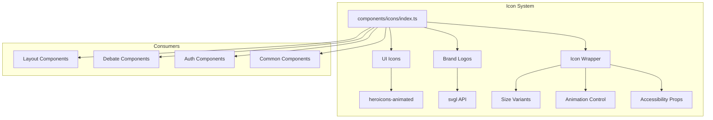

# Design Document: Animated Icons System

## Overview

This design introduces a centralized icon system for Thesis that replaces scattered inline SVGs with a unified approach using heroicons-animated for UI icons and svgl for brand logos. The system provides consistent sizing, styling, and animation capabilities while maintaining accessibility and performance.

The architecture follows a wrapper pattern where icon components from external libraries are re-exported through a central module with enhanced props for animation control, sizing, and accessibility.

## Architecture



## Components and Interfaces

### Icon Wrapper Component

The core wrapper that provides consistent props across all icons:

```typescript
// components/icons/types.ts
export type IconSize = 'xs' | 'sm' | 'md' | 'lg' | 'xl';
export type AnimationTrigger = 'hover' | 'click' | 'mount' | 'state-change' | 'none';

export interface IconProps {
  /** Icon size variant */
  size?: IconSize;
  /** Additional CSS classes */
  className?: string;
  /** Animation trigger type */
  animate?: AnimationTrigger;
  /** Disable all animations */
  noAnimation?: boolean;
  /** Accessibility label for semantic icons */
  'aria-label'?: string;
  /** Whether icon is decorative (sets aria-hidden) */
  decorative?: boolean;
  /** Custom stroke width for outline icons */
  strokeWidth?: number;
}

export const SIZE_MAP: Record<IconSize, string> = {
  xs: 'w-3 h-3',    // 12px
  sm: 'w-4 h-4',    // 16px
  md: 'w-5 h-5',    // 20px
  lg: 'w-6 h-6',    // 24px
  xl: 'w-8 h-8',    // 32px
};
```

### Icon Component Factory

```typescript
// components/icons/createIcon.tsx
import { forwardRef } from 'react';
import type { IconProps } from './types';
import { SIZE_MAP } from './types';
import { useReducedMotion } from './useReducedMotion';

export function createIcon(
  AnimatedIcon: React.ComponentType<any>,
  StaticIcon?: React.ComponentType<any>
) {
  return forwardRef<SVGSVGElement, IconProps>(function Icon(
    {
      size = 'md',
      className = '',
      animate = 'none',
      noAnimation = false,
      decorative = true,
      strokeWidth,
      'aria-label': ariaLabel,
      ...props
    },
    ref
  ) {
    const prefersReducedMotion = useReducedMotion();
    const shouldAnimate = !noAnimation && !prefersReducedMotion && animate !== 'none';
    
    const IconComponent = shouldAnimate && AnimatedIcon ? AnimatedIcon : (StaticIcon || AnimatedIcon);
    
    const sizeClass = SIZE_MAP[size];
    const combinedClassName = `${sizeClass} ${className}`.trim();
    
    return (
      <IconComponent
        ref={ref}
        className={combinedClassName}
        aria-hidden={decorative && !ariaLabel}
        aria-label={ariaLabel}
        role={ariaLabel ? 'img' : undefined}
        strokeWidth={strokeWidth}
        {...props}
      />
    );
  });
}
```

### Reduced Motion Hook

```typescript
// components/icons/useReducedMotion.ts
import { useState, useEffect } from 'react';

export function useReducedMotion(): boolean {
  const [prefersReducedMotion, setPrefersReducedMotion] = useState(false);

  useEffect(() => {
    const mediaQuery = window.matchMedia('(prefers-reduced-motion: reduce)');
    setPrefersReducedMotion(mediaQuery.matches);

    const handler = (event: MediaQueryListEvent) => {
      setPrefersReducedMotion(event.matches);
    };

    mediaQuery.addEventListener('change', handler);
    return () => mediaQuery.removeEventListener('change', handler);
  }, []);

  return prefersReducedMotion;
}
```

### Brand Logo Component

```typescript
// components/icons/BrandLogo.tsx
import { useState, useEffect, memo } from 'react';
import type { IconSize } from './types';
import { SIZE_MAP } from './types';

interface BrandLogoProps {
  /** Logo name from svgl (e.g., 'react', 'typescript') */
  name: string;
  /** Size variant */
  size?: IconSize;
  /** Light or dark variant */
  variant?: 'light' | 'dark';
  /** Additional CSS classes */
  className?: string;
  /** Fallback text if logo fails to load */
  fallback?: string;
}

// Simple in-memory cache for loaded logos
const logoCache = new Map<string, string>();

export const BrandLogo = memo(function BrandLogo({
  name,
  size = 'md',
  variant = 'light',
  className = '',
  fallback,
}: BrandLogoProps) {
  const [svg, setSvg] = useState<string | null>(logoCache.get(`${name}-${variant}`) || null);
  const [error, setError] = useState(false);

  useEffect(() => {
    const cacheKey = `${name}-${variant}`;
    if (logoCache.has(cacheKey)) {
      setSvg(logoCache.get(cacheKey)!);
      return;
    }

    // Fetch from svgl API
    fetch(`https://api.svgl.app/api/svg/${name}`)
      .then(res => res.json())
      .then(data => {
        const svgContent = variant === 'dark' && data.route?.dark 
          ? data.route.dark 
          : data.route?.light || data.route;
        logoCache.set(cacheKey, svgContent);
        setSvg(svgContent);
      })
      .catch(() => setError(true));
  }, [name, variant]);

  const sizeClass = SIZE_MAP[size];

  if (error || !svg) {
    if (fallback) {
      return <span className={`${sizeClass} ${className} inline-flex items-center justify-center text-text-secondary`}>{fallback}</span>;
    }
    return <span className={`${sizeClass} ${className} bg-gray-100 rounded`} />;
  }

  return (
    <span 
      className={`${sizeClass} ${className} inline-block`}
      dangerouslySetInnerHTML={{ __html: svg }}
      aria-hidden="true"
    />
  );
});
```

### Icon Exports

```typescript
// components/icons/index.ts
export * from './types';
export { createIcon } from './createIcon';
export { useReducedMotion } from './useReducedMotion';
export { BrandLogo } from './BrandLogo';

// Re-export animated icons from heroicons-animated
// These are added via: pnpm dlx shadcn add @heroicons-animated/check
export { CheckAnimated as CheckIcon } from '@heroicons-animated/react/outline/check';
export { XMarkAnimated as XIcon } from '@heroicons-animated/react/outline/x-mark';
export { ChevronDownAnimated as ChevronDownIcon } from '@heroicons-animated/react/outline/chevron-down';
export { ChevronUpAnimated as ChevronUpIcon } from '@heroicons-animated/react/outline/chevron-up';
export { Bars3Animated as MenuIcon } from '@heroicons-animated/react/outline/bars-3';
export { LightBulbAnimated as LightBulbIcon } from '@heroicons-animated/react/outline/light-bulb';
export { ExclamationTriangleAnimated as WarningIcon } from '@heroicons-animated/react/outline/exclamation-triangle';
export { ArrowPathAnimated as SpinnerIcon } from '@heroicons-animated/react/outline/arrow-path';
export { UserAnimated as UserIcon } from '@heroicons-animated/react/outline/user';
export { ChatBubbleLeftAnimated as ChatIcon } from '@heroicons-animated/react/outline/chat-bubble-left';
export { ArrowRightOnRectangleAnimated as SignOutIcon } from '@heroicons-animated/react/outline/arrow-right-on-rectangle';
export { ChartBarAnimated as ChartIcon } from '@heroicons-animated/react/outline/chart-bar';
export { PlusAnimated as PlusIcon } from '@heroicons-animated/react/outline/plus';
export { CheckCircleAnimated as CheckCircleIcon } from '@heroicons-animated/react/outline/check-circle';
export { XCircleAnimated as XCircleIcon } from '@heroicons-animated/react/outline/x-circle';

// Custom icons not in heroicons-animated
export { DeltaIcon } from './custom/DeltaIcon';
export { MindChangeIcon } from './custom/MindChangeIcon';
export { ImpactIcon } from './custom/ImpactIcon';
export { VoteIcon } from './custom/VoteIcon';
```

## Data Models

### Icon Registry

For tracking available icons and their capabilities:

```typescript
interface IconMetadata {
  name: string;
  hasAnimation: boolean;
  category: 'navigation' | 'action' | 'status' | 'social' | 'custom';
  defaultSize: IconSize;
}

const ICON_REGISTRY: Record<string, IconMetadata> = {
  check: { name: 'CheckIcon', hasAnimation: true, category: 'status', defaultSize: 'md' },
  x: { name: 'XIcon', hasAnimation: true, category: 'action', defaultSize: 'md' },
  chevronDown: { name: 'ChevronDownIcon', hasAnimation: true, category: 'navigation', defaultSize: 'sm' },
  // ... etc
};
```

## Correctness Properties

*A property is a characteristic or behavior that should hold true across all valid executions of a system—essentially, a formal statement about what the system should do. Properties serve as the bridge between human-readable specifications and machine-verifiable correctness guarantees.*

### Property 1: Consistent Icon API

*For any* icon component exported from the Icon_System, it SHALL accept the standard IconProps interface (size, className, animate, noAnimation, decorative, aria-label) and render without errors.

**Validates: Requirements 1.4, 8.1**

### Property 2: Size Variant Rendering

*For any* icon and *for any* size variant (xs, sm, md, lg, xl), the rendered SVG element SHALL have the corresponding CSS class applied (w-3 h-3, w-4 h-4, w-5 h-5, w-6 h-6, w-8 h-8).

**Validates: Requirements 7.1**

### Property 3: ClassName Merging

*For any* icon with a custom className prop, the rendered element SHALL contain both the size class and the custom class.

**Validates: Requirements 7.2**

### Property 4: CurrentColor Inheritance

*For any* icon rendered without explicit color props, the SVG fill or stroke SHALL use "currentColor" to inherit from parent.

**Validates: Requirements 7.3**

### Property 5: Animation Disable

*For any* icon with noAnimation=true, the rendered component SHALL not have animation-related CSS classes or Motion props applied.

**Validates: Requirements 8.5**

### Property 6: Decorative Accessibility

*For any* icon with decorative=true (or no aria-label), the rendered element SHALL have aria-hidden="true".

**Validates: Requirements 10.1**

### Property 7: Semantic Icon Role

*For any* icon with an aria-label prop, the rendered element SHALL have role="img" and the provided aria-label.

**Validates: Requirements 10.3**

### Property 8: Logo Cache Consistency

*For any* brand logo name, fetching the logo twice SHALL return the same SVG content from cache without making a second network request.

**Validates: Requirements 6.1**

### Property 9: Fallback Rendering

*For any* icon or logo that fails to load, the component SHALL render a fallback element without throwing an error.

**Validates: Requirements 9.4, 6.4**

## Error Handling

### Icon Load Failures

When an animated icon fails to load (e.g., missing from heroicons-animated):
1. Log a warning in development mode
2. Fall back to a static SVG version if available
3. Render an empty placeholder if no fallback exists

### Brand Logo Failures

When a brand logo fails to fetch from svgl:
1. Display the fallback text if provided
2. Show a neutral placeholder (gray rounded rectangle) if no fallback
3. Cache the failure to prevent repeated requests

### Animation Errors

When animation fails (e.g., Motion library error):
1. Catch the error in an error boundary
2. Render the static version of the icon
3. Log the error for debugging

## Testing Strategy

### Unit Tests

Unit tests verify specific examples and edge cases:

1. **Icon rendering**: Each icon renders without errors
2. **Size variants**: Each size produces correct dimensions
3. **Accessibility**: aria-hidden and aria-label are set correctly
4. **Fallback behavior**: Missing icons render fallbacks
5. **Cache behavior**: Logo cache prevents duplicate fetches

### Property-Based Tests

Property tests verify universal properties across all inputs using fast-check:

1. **Consistent API**: All icons accept standard props
2. **Size mapping**: All size variants map to correct classes
3. **ClassName merging**: Custom classes are always preserved
4. **Accessibility compliance**: Decorative icons always have aria-hidden

### Integration Tests

1. **Component integration**: Icons render correctly within layout components
2. **Animation triggers**: Hover/click/mount animations fire appropriately
3. **Reduced motion**: Animations respect prefers-reduced-motion

### Test Configuration

- Use Vitest as the test runner
- Use fast-check for property-based testing with minimum 100 iterations
- Use Testing Library for React component testing
- Mock fetch for svgl API tests
