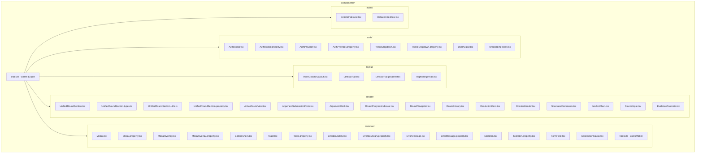

# Design Document: Component Reorganization

## Overview

This design document outlines the reorganization of the frontend components directory from a flat structure with 49 files into a logical, maintainable hierarchy. The reorganization removes obsolete components, consolidates duplicated utilities, and groups related components together while maintaining backward compatibility.

### Key Design Decisions

1. **Subdirectory Organization**: Group components by domain (auth, layout, debate, common, index)
2. **Co-location**: Keep related files (types, utils, tests) with their components
3. **Backward Compatibility**: Maintain existing import paths through barrel re-exports
4. **Minimal Disruption**: Only move files, don't refactor component internals

## Architecture



## Components and Interfaces

### Directory Structure

```
packages/frontend/src/components/
├── index.ts                          # Main barrel export
├── auth/
│   ├── index.ts                      # Auth group barrel
│   ├── AuthModal.tsx
│   ├── AuthModal.property.tsx
│   ├── AuthModalStyling.property.tsx
│   ├── AuthModalToast.property.tsx
│   ├── AuthProvider.tsx
│   ├── AuthProvider.property.tsx
│   ├── ProfileDropdown.tsx
│   ├── ProfileDropdown.property.tsx
│   ├── UserAvatar.tsx
│   └── OnboardingToast.tsx
├── layout/
│   ├── index.ts                      # Layout group barrel
│   ├── ThreeColumnLayout.tsx
│   ├── LeftNavRail.tsx
│   ├── LeftNavRail.property.tsx
│   └── RightMarginRail.tsx
├── debate/
│   ├── index.ts                      # Debate group barrel
│   ├── UnifiedRoundSection.tsx
│   ├── UnifiedRoundSection.types.ts
│   ├── UnifiedRoundSection.utils.ts
│   ├── UnifiedRoundSection.property.tsx
│   ├── ActiveRoundView.tsx
│   ├── ArgumentSubmissionForm.tsx
│   ├── ArgumentBlock.tsx
│   ├── RoundProgressIndicator.tsx
│   ├── RoundNavigator.tsx
│   ├── RoundHistory.tsx
│   ├── ResolutionCard.tsx
│   ├── DossierHeader.tsx
│   ├── SpectatorComments.tsx
│   ├── MarketChart.tsx
│   ├── StanceInput.tsx
│   └── EvidenceFootnote.tsx
├── common/
│   ├── index.ts                      # Common group barrel
│   ├── hooks.ts                      # Shared hooks (useIsMobile)
│   ├── Modal.tsx
│   ├── Modal.property.tsx
│   ├── ModalOverlay.tsx
│   ├── ModalOverlay.property.tsx
│   ├── BottomSheet.tsx
│   ├── Toast.tsx
│   ├── Toast.property.tsx
│   ├── ErrorBoundary.tsx
│   ├── ErrorBoundary.property.tsx
│   ├── ErrorMessage.tsx
│   ├── ErrorMessage.property.tsx
│   ├── Skeleton.tsx
│   ├── Skeleton.property.tsx
│   ├── FormField.tsx
│   └── ConnectionStatus.tsx
└── index/
    ├── index.ts                      # Index group barrel
    ├── DebateIndexList.tsx
    └── DebateIndexRow.tsx
```

### Files to Remove (Obsolete)

| File | Reason |
|------|--------|
| `RoundSection.tsx` | Replaced by `UnifiedRoundSection` - no longer imported anywhere |

### Hook Consolidation

The `useIsMobile` hook is currently defined in multiple files:
- `Modal.tsx` (line 27-42)
- `RoundHistory.tsx` (line 41-55)

These will be consolidated into `common/hooks.ts` and re-exported.

```typescript
// common/hooks.ts
export function useIsMobile(breakpoint: number = 640): boolean {
  const [isMobile, setIsMobile] = useState(() => {
    if (typeof window === 'undefined') return false;
    return window.innerWidth < breakpoint;
  });

  useEffect(() => {
    const handleResize = () => {
      setIsMobile(window.innerWidth < breakpoint);
    };
    handleResize();
    window.addEventListener('resize', handleResize);
    return () => window.removeEventListener('resize', handleResize);
  }, [breakpoint]);

  return isMobile;
}
```

### Barrel Export Structure

The main `index.ts` will re-export from subdirectory barrels:

```typescript
// components/index.ts

// ============================================
// Auth Components
// ============================================
export {
  AuthModalProvider,
  useAuthModal,
  useRequireAuth,
} from './auth';
export { AuthProvider, validateUsername } from './auth';
export { ProfileDropdown } from './auth';
export type { ProfileDropdownProps, ProfileDropdownUser } from './auth';
export { UserAvatar } from './auth';
export type { UserAvatarProps } from './auth';
export { OnboardingToast, useOnboardingToast, useAutoOnboarding } from './auth';

// ============================================
// Layout Components
// ============================================
export { ThreeColumnLayout } from './layout';
export { 
  LeftNavRail, 
  useActiveSectionObserver, 
  generateDebateRoundsLabel, 
  createUnifiedTocSections 
} from './layout';
export type { NavSection } from './layout';
export { RightMarginRail } from './layout';

// ... (continues for all groups)
```

## Data Models

No new data models are introduced. This is a file organization change only.

## Correctness Properties

*A property is a characteristic or behavior that should hold true across all valid executions of a system—essentially, a formal statement about what the system should do. Properties serve as the bridge between human-readable specifications and machine-verifiable correctness guarantees.*

### Property 1: Co-location of Related Files

*For any* component that has associated files (`.types.ts`, `.utils.ts`, `.property.tsx`, `.integration.test.tsx`), all associated files SHALL be located in the same directory as the component.

**Validates: Requirements 2.4, 4.1, 4.2, 4.3, 4.4**

### Property 2: Export Backward Compatibility

*For any* component or type that was previously exported from `components/index.ts`, it SHALL remain importable from `components/index.ts` after reorganization.

**Validates: Requirements 3.2, 6.2**

## Error Handling

This reorganization is a structural change with no runtime error handling requirements. Errors during reorganization are handled by:

1. **Build Errors**: TypeScript compilation will fail if imports are broken
2. **Test Failures**: Existing tests will fail if components are incorrectly moved
3. **Git History**: All changes are tracked and reversible

## Testing Strategy

### Verification Approach

Since this is a file reorganization (not new functionality), testing focuses on:

1. **Build Verification**: TypeScript compilation succeeds
2. **Test Suite**: All existing tests pass without modification to test logic
3. **Import Verification**: Spot-check that imports work from expected paths

### Property-Based Tests

Property tests are not applicable for file reorganization. The correctness properties are verified through:

- **Property 1 (Co-location)**: Manual verification of directory structure
- **Property 2 (Backward Compatibility)**: Build success + existing test suite passing

### Unit Tests

No new unit tests required. Existing tests validate component behavior.

### Integration Tests

The existing `SignUpProfileFlow.integration.test.tsx` will be moved to `auth/` directory and its imports updated.

### Validation Checklist

- [ ] `bun run build` succeeds
- [ ] `bun run test` passes all tests
- [ ] No TypeScript errors in IDE
- [ ] `RoundSection.tsx` is deleted
- [ ] `useIsMobile` exists only in `common/hooks.ts`
