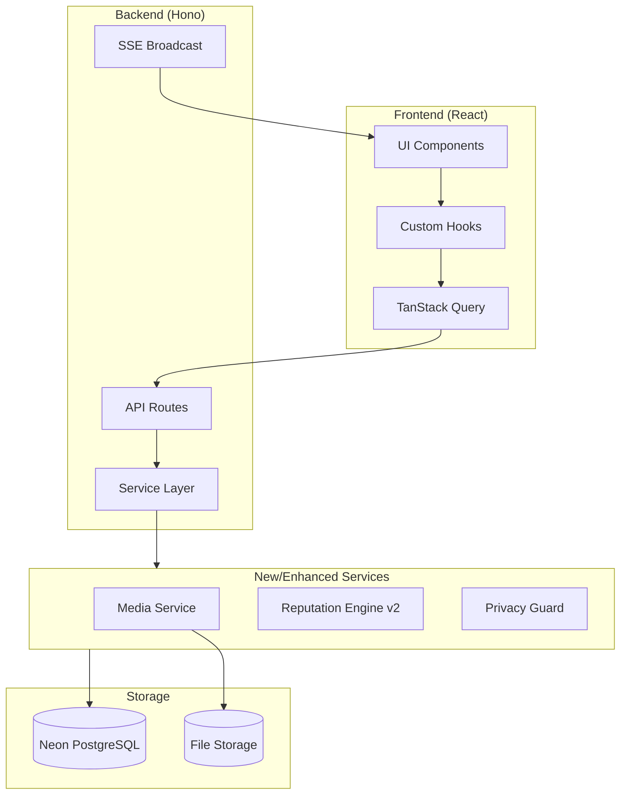
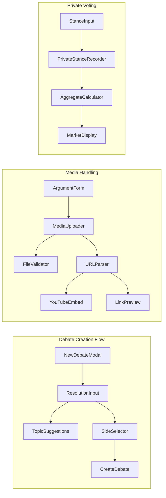

# Design Document: Debate Lifecycle UX Enhancement

## Overview

This design document outlines the architecture and implementation approach for enhancing Thesis's lifecycle and user experience. The enhancements focus on making debates more accessible, supporting rich media, ensuring vote privacy, implementing intelligent reputation scoring, and providing a world-class research UX.

The design builds upon the existing Hono backend, React frontend with TanStack Router/Query, and Drizzle ORM with Neon PostgreSQL. New components will integrate seamlessly with the current service-oriented architecture.

## Architecture

### High-Level Architecture



### Component Architecture



## Components and Interfaces

### Backend Services

#### MediaService

Handles file uploads, URL parsing, and media preview generation.

```typescript
interface MediaService {
  // Upload a file attachment for an argument
  uploadFile(file: File, argumentId: string, userId: string): Promise<MediaAttachment>;
  
  // Parse a URL and generate preview metadata
  parseUrl(url: string): Promise<UrlPreview>;
  
  // Extract YouTube video metadata
  parseYouTubeUrl(url: string): Promise<YouTubePreview>;
  
  // Validate file type and size
  validateFile(file: File): ValidationResult;
  
  // Get all media for an argument
  getArgumentMedia(argumentId: string): Promise<MediaAttachment[]>;
}

interface MediaAttachment {
  id: string;
  argumentId: string;
  type: 'file' | 'youtube' | 'link';
  url: string;
  thumbnailUrl?: string;
  title?: string;
  description?: string;
  mimeType?: string;
  fileSize?: number;
  createdAt: Date;
}

interface UrlPreview {
  url: string;
  title: string;
  description: string;
  thumbnailUrl?: string;
  siteName?: string;
  type: 'article' | 'video' | 'image' | 'other';
}

interface YouTubePreview {
  videoId: string;
  title: string;
  thumbnailUrl: string;
  channelName: string;
  duration?: string;
}
```

#### ReputationEngineV2

Enhanced reputation calculation with multi-factor scoring.

```typescript
interface ReputationEngineV2 {
  // Calculate comprehensive reputation score
  calculateReputation(userId: string): Promise<ReputationScore>;
  
  // Update reputation after debate conclusion
  processDebateConclusion(debateId: string, result: DebateResult): Promise<void>;
  
  // Apply time-based decay to inactive users
  applyDecay(userId: string, daysSinceActive: number): Promise<number>;
  
  // Calculate vote weight based on reputation factors
  calculateVoteWeight(userId: string): Promise<number>;
  
  // Get reputation breakdown for user profile
  getReputationBreakdown(userId: string): Promise<ReputationBreakdown>;
}

interface ReputationScore {
  overall: number;           // 0-1000 scale
  persuasionSkill: number;   // Based on impact scores
  predictionAccuracy: number; // Based on correct predictions
  consistency: number;        // Based on participation quality
  trustLevel: number;         // Derived from all factors
}

interface ReputationBreakdown {
  overall: number;
  factors: {
    name: string;
    value: number;
    weight: number;
    contribution: number;
  }[];
  recentChanges: {
    date: Date;
    change: number;
    reason: string;
  }[];
  rank?: number;
  percentile?: number;
}

// Reputation calculation weights
const REPUTATION_WEIGHTS = {
  impactScore: 0.35,        // How much arguments change minds
  predictionAccuracy: 0.25, // How well user predicts outcomes
  participationQuality: 0.20, // Engagement without gaming
  consistency: 0.10,        // Regular quality contributions
  communityTrust: 0.10,     // Reactions and endorsements
};

// Diminishing returns formula
const calculateDiminishingReturns = (rawScore: number, count: number): number => {
  // Each additional contribution has less impact
  // Score = rawScore * (1 / (1 + log(count)))
  return rawScore * (1 / (1 + Math.log10(count + 1)));
};
```

#### PrivacyGuard

Ensures stance data privacy and aggregate-only exposure.

```typescript
interface PrivacyGuard {
  // Check if user can access their own stance data
  canAccessOwnStance(userId: string, requesterId: string): boolean;
  
  // Filter stance data for public API responses
  filterForPublicResponse(stances: Stance[]): AggregateStanceData;
  
  // Validate API request doesn't expose individual votes
  validatePrivacyCompliance(query: StanceQuery): ValidationResult;
  
  // Get aggregate statistics only
  getAggregateStats(debateId: string): Promise<AggregateStanceData>;
}

interface AggregateStanceData {
  totalVoters: number;
  averagePreStance: number;
  averagePostStance: number;
  averageDelta: number;
  mindChangedCount: number;
  // Individual voter data is NEVER included
}
```

### Frontend Components

#### MediaUploader Component

```typescript
interface MediaUploaderProps {
  argumentId?: string;
  onMediaAdded: (media: MediaAttachment) => void;
  onError: (error: string) => void;
  maxFiles?: number;
  acceptedTypes?: string[];
}

// Supported file types
const ACCEPTED_FILE_TYPES = [
  'image/jpeg',
  'image/png',
  'image/gif',
  'image/webp',
  'application/pdf',
  'application/msword',
  'application/vnd.openxmlformats-officedocument.wordprocessingml.document',
];

const MAX_FILE_SIZE = 10 * 1024 * 1024; // 10MB
```

#### EnhancedArgumentForm Component

```typescript
interface EnhancedArgumentFormProps {
  roundType: 'opening' | 'rebuttal' | 'closing';
  side: 'support' | 'oppose';
  onSubmit: (content: string, media: MediaAttachment[]) => void;
  isSubmitting: boolean;
}
```

#### DebateProgressIndicator Component

```typescript
interface DebateProgressIndicatorProps {
  debate: Debate;
  currentRound: number;
  currentTurn: 'support' | 'oppose';
  isUserTurn: boolean;
}
```

### Database Schema Extensions

```sql
-- Media attachments table
CREATE TABLE media_attachments (
  id TEXT PRIMARY KEY,
  argument_id TEXT REFERENCES arguments(id) ON DELETE CASCADE,
  type TEXT NOT NULL CHECK (type IN ('file', 'youtube', 'link')),
  url TEXT NOT NULL,
  thumbnail_url TEXT,
  title TEXT,
  description TEXT,
  mime_type TEXT,
  file_size INTEGER,
  created_at TIMESTAMP NOT NULL DEFAULT NOW()
);

-- Reputation history for tracking changes
CREATE TABLE reputation_history (
  id TEXT PRIMARY KEY,
  user_id TEXT NOT NULL REFERENCES users(id),
  previous_score REAL NOT NULL,
  new_score REAL NOT NULL,
  change_amount REAL NOT NULL,
  reason TEXT NOT NULL,
  debate_id TEXT REFERENCES debates(id),
  created_at TIMESTAMP NOT NULL DEFAULT NOW()
);

-- Reputation factors breakdown
CREATE TABLE reputation_factors (
  id TEXT PRIMARY KEY,
  user_id TEXT NOT NULL REFERENCES users(id),
  impact_score_total REAL NOT NULL DEFAULT 0,
  prediction_accuracy REAL NOT NULL DEFAULT 50,
  participation_count INTEGER NOT NULL DEFAULT 0,
  quality_score REAL NOT NULL DEFAULT 0,
  last_active_at TIMESTAMP,
  updated_at TIMESTAMP NOT NULL DEFAULT NOW(),
  UNIQUE(user_id)
);

-- Index for privacy-compliant aggregate queries
CREATE INDEX idx_stances_debate_aggregate ON stances(debate_id, type);
-- Note: No index on voter_id for public queries to enforce privacy
```

## Data Models

### MediaAttachment

```typescript
interface MediaAttachment {
  id: string;
  argumentId: string;
  type: 'file' | 'youtube' | 'link';
  url: string;
  thumbnailUrl: string | null;
  title: string | null;
  description: string | null;
  mimeType: string | null;
  fileSize: number | null;
  createdAt: Date;
}
```

### ReputationFactor

```typescript
interface ReputationFactor {
  id: string;
  userId: string;
  impactScoreTotal: number;
  predictionAccuracy: number;
  participationCount: number;
  qualityScore: number;
  lastActiveAt: Date | null;
  updatedAt: Date;
}
```

### ReputationHistory

```typescript
interface ReputationHistory {
  id: string;
  userId: string;
  previousScore: number;
  newScore: number;
  changeAmount: number;
  reason: string;
  debateId: string | null;
  createdAt: Date;
}
```


## Correctness Properties

*A property is a characteristic or behavior that should hold true across all valid executions of a system—essentially, a formal statement about what the system should do. Properties serve as the bridge between human-readable specifications and machine-verifiable correctness guarantees.*

### Property 1: Debate Initialization Invariant

*For any* newly created debate, the initial state SHALL have status "active", currentRound = 1, currentTurn = "support", opposeDebaterId = null, and market price at exactly 50/50.

**Validates: Requirements 1.5**

### Property 2: Character Count Accuracy

*For any* string input to the resolution field, the displayed character count SHALL equal the exact length of the input string.

**Validates: Requirements 1.2**

### Property 3: Topic Acceptance Universality

*For any* non-empty string within the character limit (500 chars), the debate creation SHALL accept it as a valid resolution regardless of topic domain.

**Validates: Requirements 1.4**

### Property 4: File Upload Size Validation

*For any* file upload, IF the file size is ≤ 10MB AND the MIME type is in the accepted list, THEN the upload SHALL succeed; OTHERWISE it SHALL be rejected with an appropriate error message.

**Validates: Requirements 2.1, 2.5, 2.6**

### Property 5: YouTube URL Parsing Round-Trip

*For any* valid YouTube URL (matching youtube.com/watch?v= or youtu.be/ patterns), parsing SHALL extract a videoId, and the extracted videoId SHALL be usable to reconstruct a valid YouTube URL.

**Validates: Requirements 2.2**

### Property 6: Web URL Preview Structure

*For any* valid HTTP/HTTPS URL, the preview response SHALL contain at minimum a title field (possibly empty string) and the original URL.

**Validates: Requirements 2.3**

### Property 7: Vote Privacy Invariant

*For any* API response containing stance data for a debate, the response SHALL NOT contain any voter_id field or any data that could identify individual voters. Only aggregate statistics (counts, averages) SHALL be included.

**Validates: Requirements 3.1, 3.2, 3.3, 3.5**

### Property 8: Self-Access Vote Retrieval

*For any* user requesting their own stance history, the response SHALL include their individual stance records. *For any* user requesting another user's stance history, the response SHALL be empty or return an authorization error.

**Validates: Requirements 3.4**

### Property 9: Blind Voting Enforcement

*For any* user who has NOT recorded a pre-stance for a debate, requests for market price data SHALL return a "pre-stance required" error or hide the price data.

**Validates: Requirements 3.6**

### Property 10: Multi-Factor Reputation Calculation

*For any* reputation calculation, the result SHALL be influenced by at least two distinct factors (impact score, prediction accuracy, participation quality). Changing only one factor while holding others constant SHALL produce a different reputation score.

**Validates: Requirements 4.1, 4.5**

### Property 11: Impact-Proportional Reputation

*For any* argument with impact score I₁ and another with impact score I₂ where I₁ > I₂, the reputation increase from I₁ SHALL be greater than or equal to the increase from I₂ (monotonically increasing).

**Validates: Requirements 4.2**

### Property 12: Prediction Accuracy Update

*For any* correct prediction (user's post-stance direction matches debate outcome), the user's prediction accuracy score SHALL increase. *For any* incorrect prediction, the score SHALL decrease or remain unchanged.

**Validates: Requirements 4.3**

### Property 13: Diminishing Returns Formula

*For any* sequence of N identical reputation-earning actions, the total reputation gained SHALL be less than N times the first action's gain. Specifically: totalGain < N × firstActionGain.

**Validates: Requirements 4.4**

### Property 14: Reputation Decay Over Time

*For any* user inactive for D days where D > decay_threshold, their reputation score SHALL be less than or equal to their score at the start of inactivity.

**Validates: Requirements 4.6**

### Property 15: Low-Impact Neutrality

*For any* argument with impact score below the significance threshold, the author's reputation change SHALL be within ±1 point (effectively neutral).

**Validates: Requirements 4.7**

### Property 16: Results Summary Completeness

*For any* concluded debate, the results summary SHALL contain: finalSupportPrice, finalOpposePrice, totalMindChanges, netPersuasionDelta, and winnerSide.

**Validates: Requirements 5.4**

### Property 17: Reaction Recording Integrity

*For any* reaction submitted by a user on an argument, querying reactions for that argument SHALL include the submitted reaction type in the aggregate count.

**Validates: Requirements 6.1**

### Property 18: Reaction Privacy

*For any* API response containing reaction data, the response SHALL include aggregate counts (agree: N, strongReasoning: M) but SHALL NOT include any user identifiers of who reacted.

**Validates: Requirements 6.3**

### Property 19: Trending Algorithm Consistency

*For any* two debates D₁ and D₂ where D₁ has strictly higher engagement metrics (votes + reactions + comments), D₁ SHALL appear at or above D₂ in trending rankings.

**Validates: Requirements 6.4**

### Property 20: Comment Threading Integrity

*For any* comment with parentId P, the parent comment with id P SHALL exist in the database. *For any* comment retrieval, replies SHALL be correctly nested under their parent.

**Validates: Requirements 6.5**

### Property 21: Sandbox Completion Vote Weight

*For any* user who has completed sandbox requirements (5 debates), their vote weight SHALL be 1.0 (full weight). *For any* user who has NOT completed sandbox, their vote weight SHALL be 0.5 (half weight).

**Validates: Requirements 7.3**

### Property 22: Short Argument Feedback

*For any* argument submission rejected for being too short, the error response SHALL include a specific character count requirement and improvement suggestion.

**Validates: Requirements 7.5**

### Property 23: Touch Target Minimum Size

*For any* interactive element (button, link, input) in the UI, the computed dimensions SHALL be at least 44px × 44px.

**Validates: Requirements 8.3**

## Error Handling

### Media Upload Errors

| Error Condition | Error Code | User Message |
|----------------|------------|--------------|
| File too large (>10MB) | MEDIA_TOO_LARGE | "File exceeds 10MB limit. Please compress or choose a smaller file." |
| Unsupported file type | MEDIA_INVALID_TYPE | "This file type is not supported. Accepted: images, PDFs, documents." |
| Upload failed | MEDIA_UPLOAD_FAILED | "Upload failed. Please try again." |
| URL parsing failed | MEDIA_URL_INVALID | "Could not fetch preview for this URL." |
| YouTube URL invalid | MEDIA_YOUTUBE_INVALID | "Invalid YouTube URL. Please use a youtube.com or youtu.be link." |

### Privacy Errors

| Error Condition | Error Code | User Message |
|----------------|------------|--------------|
| Accessing other user's votes | PRIVACY_UNAUTHORIZED | "You can only view your own voting history." |
| Market price before pre-stance | BLIND_VOTING_REQUIRED | "Record your initial stance to see the market price." |

### Reputation Errors

| Error Condition | Error Code | User Message |
|----------------|------------|--------------|
| Reputation calculation failed | REPUTATION_CALC_ERROR | "Could not update reputation. Please try again later." |

## Testing Strategy

### Unit Tests

Unit tests will cover:
- MediaService URL parsing (YouTube, web links)
- File validation logic
- ReputationEngineV2 calculation formulas
- PrivacyGuard filtering logic
- Vote weight calculation

### Property-Based Tests

Property-based tests using fast-check will validate:
- All 23 correctness properties defined above
- Each property test will run minimum 100 iterations
- Tests will be tagged with format: **Feature: debate-lifecycle-ux, Property N: [property_text]**

### Integration Tests

Integration tests will cover:
- Full debate creation flow with media attachments
- Stance recording and privacy enforcement
- Reputation updates after debate conclusion
- SSE broadcast for real-time updates

### Test Configuration

```typescript
// vitest.config.ts additions
export default defineConfig({
  test: {
    // Property tests need more iterations
    testTimeout: 30000,
    // Tag format for property tests
    reporters: ['default'],
  },
});
```

### Property Test Implementation Pattern

```typescript
import { describe, it, expect } from 'vitest';
import * as fc from 'fast-check';

describe('ReputationEngineV2', () => {
  // Feature: debate-lifecycle-ux, Property 13: Diminishing Returns Formula
  it('should apply diminishing returns to repeated actions', () => {
    fc.assert(
      fc.property(
        fc.integer({ min: 1, max: 100 }), // rawScore
        fc.integer({ min: 2, max: 50 }),  // actionCount
        (rawScore, actionCount) => {
          const firstGain = calculateDiminishingReturns(rawScore, 1);
          let totalGain = 0;
          for (let i = 1; i <= actionCount; i++) {
            totalGain += calculateDiminishingReturns(rawScore, i);
          }
          // Total gain should be less than actionCount * firstGain
          return totalGain < actionCount * firstGain;
        }
      ),
      { numRuns: 100 }
    );
  });
});
```

