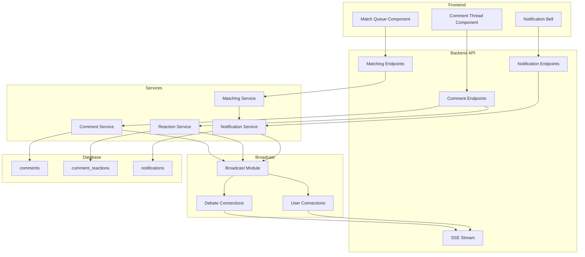

# Design Document: Enhanced Comments & Opponent Matching

## Overview

This design covers two major feature sets for Thesis:

1. **Enhanced Comment System** - Extends the existing comment functionality with threaded display, comment reactions (support/oppose), and real-time updates via SSE.

2. **Opponent Matching System** - Introduces a queue-based system for debates seeking opponents, with auto-matching based on reputation and real-time notifications.

Both features integrate with the existing Hono backend, Drizzle ORM, and SSE broadcast infrastructure.

## Architecture



## Components and Interfaces

### Comment Service Extensions

The existing `CommentService` will be extended with tree-building capabilities:

```typescript
interface CommentWithReplies extends Comment {
  replyCount: number;
  replies?: CommentWithReplies[];
  isParentDeleted?: boolean;
}

interface CommentTreeOptions {
  maxDepth?: number;  // Default: unlimited
  includeDeleted?: boolean;  // Default: false
}

class CommentService {
  // Existing methods...
  
  // New methods for threading
  async getCommentTree(debateId: string, options?: CommentTreeOptions): Promise<CommentWithReplies[]>;
  async getReplyCount(commentId: string): Promise<number>;
  async softDeleteComment(commentId: string): Promise<boolean>;
}
```

### Reaction Service Extensions

Extend `ReactionService` to handle comment reactions:

```typescript
type CommentReactionType = 'support' | 'oppose';

interface CommentReaction {
  id: string;
  commentId: string;
  userId: string;
  type: CommentReactionType;
  createdAt: Date;
}

interface CommentReactionCounts {
  support: number;
  oppose: number;
}

interface CreateCommentReactionInput {
  commentId: string;
  userId: string;
  type: CommentReactionType;
}

class ReactionService {
  // Existing argument reaction methods...
  
  // New comment reaction methods
  async addCommentReaction(input: CreateCommentReactionInput): Promise<CommentReaction>;
  async removeCommentReaction(commentId: string, userId: string, type: CommentReactionType): Promise<boolean>;
  async getCommentReactionCounts(commentId: string): Promise<CommentReactionCounts>;
  async getUserCommentReactions(commentId: string, userId: string): Promise<{ support: boolean; oppose: boolean }>;
}
```

### Matching Service (New)

```typescript
interface QueuedDebate {
  debate: Debate;
  creator: User;
  queuedAt: Date;
}

interface MatchResult {
  debate: Debate;
  reputationDiff: number;
}

interface QueueFilter {
  keywords?: string[];
  maxReputationDiff?: number;
}

class MatchingService {
  async getOpponentQueue(filter?: QueueFilter): Promise<QueuedDebate[]>;
  async findMatches(userId: string, limit?: number): Promise<MatchResult[]>;
  async isInQueue(debateId: string): Promise<boolean>;
  
  // Called automatically by debate service hooks
  async onDebateCreated(debate: Debate): Promise<void>;
  async onOpponentJoined(debateId: string): Promise<void>;
  async onDebateConcluded(debateId: string): Promise<void>;
}
```

### Notification Service (New)

```typescript
type NotificationType = 'opponent_joined' | 'debate_started' | 'your_turn';

interface Notification {
  id: string;
  userId: string;
  type: NotificationType;
  message: string;
  debateId?: string;
  read: boolean;
  createdAt: Date;
}

interface CreateNotificationInput {
  userId: string;
  type: NotificationType;
  message: string;
  debateId?: string;
}

class NotificationService {
  async createNotification(input: CreateNotificationInput): Promise<Notification>;
  async getUserNotifications(userId: string, unreadOnly?: boolean): Promise<Notification[]>;
  async markAsRead(notificationId: string): Promise<boolean>;
  async markAllAsRead(userId: string): Promise<number>;
  async getUnreadCount(userId: string): Promise<number>;
}
```

### Broadcast Module Extensions

```typescript
// New event types
type EventType = 'market' | 'comment' | 'argument' | 'reaction' | 'round' | 
                 'steelman' | 'debate-join' | 'comment-reaction' | 'notification';

interface BroadcastPayload {
  // Existing payloads...
  
  'comment-reaction': {
    commentId: string;
    reactionType: CommentReactionType;
    counts: CommentReactionCounts;
  };
  
  notification: {
    id: string;
    type: NotificationType;
    message: string;
    debateId?: string;
    createdAt: string;
  };
}

// User-specific connections for notifications
const userConnections = new Map<string, Set<(data: string) => void>>();

function addUserConnection(userId: string, sendFn: (data: string) => void): void;
function removeUserConnection(userId: string, sendFn: (data: string) => void): void;
function broadcastToUser(userId: string, eventType: string, payload: unknown): void;
```

## Data Models

### Database Schema Extensions

```typescript
// New enum for comment reactions
export const commentReactionTypeEnum = pgEnum('comment_reaction_type', ['support', 'oppose']);

// New enum for notification types
export const notificationTypeEnum = pgEnum('notification_type', ['opponent_joined', 'debate_started', 'your_turn']);

// Comment reactions table
export const commentReactions = pgTable('comment_reactions', {
  id: text('id').primaryKey(),
  commentId: text('comment_id').notNull().references(() => comments.id, { onDelete: 'cascade' }),
  userId: text('user_id').notNull().references(() => users.id),
  type: commentReactionTypeEnum('type').notNull(),
  createdAt: timestamp('created_at').notNull().defaultNow(),
});

// Add unique constraint: one reaction type per user per comment
// Handled via unique index in migration

// Notifications table
export const notifications = pgTable('notifications', {
  id: text('id').primaryKey(),
  userId: text('user_id').notNull().references(() => users.id),
  type: notificationTypeEnum('type').notNull(),
  message: text('message').notNull(),
  debateId: text('debate_id').references(() => debates.id),
  read: boolean('read').notNull().default(false),
  createdAt: timestamp('created_at').notNull().defaultNow(),
});

// Extend comments table with soft delete
// Add column: deletedAt: timestamp('deleted_at')
```

### Shared Types Extensions

```typescript
// Comment reaction types
export type CommentReactionType = 'support' | 'oppose';

export interface CommentReaction {
  id: string;
  commentId: string;
  userId: string;
  type: CommentReactionType;
  createdAt: Date;
}

export interface CommentReactionCounts {
  support: number;
  oppose: number;
}

export interface CreateCommentReactionInput {
  commentId: string;
  userId: string;
  type: CommentReactionType;
}

// Notification types
export type NotificationType = 'opponent_joined' | 'debate_started' | 'your_turn';

export interface Notification {
  id: string;
  userId: string;
  type: NotificationType;
  message: string;
  debateId?: string | null;
  read: boolean;
  createdAt: Date;
}

export interface CreateNotificationInput {
  userId: string;
  type: NotificationType;
  message: string;
  debateId?: string;
}

// Extended comment with threading info
export interface CommentWithReplies extends Comment {
  replyCount: number;
  replies?: CommentWithReplies[];
  isParentDeleted?: boolean;
}

// Queue types
export interface QueuedDebate {
  debate: Debate;
  creatorUsername: string;
  creatorReputation: number;
  queuedAt: Date;
}
```

## Correctness Properties

*A property is a characteristic or behavior that should hold true across all valid executions of a system—essentially, a formal statement about what the system should do. Properties serve as the bridge between human-readable specifications and machine-verifiable correctness guarantees.*

### Property 1: Comment Tree Structure Preservation

*For any* set of comments with parent-child relationships stored in the database, retrieving them via `getCommentTree()` SHALL produce a tree where each comment's parent ID matches its position in the hierarchy.

**Validates: Requirements 1.1, 1.3**

### Property 2: Reply Count Accuracy

*For any* comment with N direct child comments, the `replyCount` field SHALL equal N.

**Validates: Requirements 1.2**

### Property 3: Deleted Parent Indicator

*For any* comment whose parent has been soft-deleted, the `isParentDeleted` flag SHALL be true.

**Validates: Requirements 1.4**

### Property 4: Comment Reaction Uniqueness

*For any* user and comment, attempting to add a reaction of the same type twice SHALL result in exactly one stored reaction (the first), with subsequent attempts rejected.

**Validates: Requirements 2.1, 2.2**

### Property 5: Comment Reaction Count Consistency

*For any* comment, the reaction counts returned by `getCommentReactionCounts()` SHALL equal the actual count of stored reactions of each type.

**Validates: Requirements 2.3, 2.4**

### Property 6: Queue Membership Invariant

*For any* debate, it SHALL be in the opponent queue if and only if: (a) it has no opponent assigned, AND (b) its status is 'active'.

**Validates: Requirements 4.1, 4.2, 4.4**

### Property 7: Queue FIFO Ordering

*For any* two debates D1 and D2 in the opponent queue where D1 was created before D2, D1 SHALL appear before D2 in the queue listing and in match results.

**Validates: Requirements 4.3, 5.5**

### Property 8: Self-Exclusion from Matches

*For any* user U requesting auto-matching, no debate created by U SHALL appear in the match results.

**Validates: Requirements 5.3**

### Property 9: Reputation-Based Match Prioritization

*For any* user U with reputation R requesting matches, debates whose creators have reputation within [R-20, R+20] SHALL appear before debates outside that range.

**Validates: Requirements 5.2**

### Property 10: Notification Storage Completeness

*For any* notification created, it SHALL be retrievable via `getUserNotifications()` with all fields (id, userId, type, message, read, createdAt) intact.

**Validates: Requirements 6.2, 7.4**

### Property 11: Notification Ordering

*For any* user's notification list, unread notifications SHALL appear before read notifications, and within each group, newer notifications SHALL appear first.

**Validates: Requirements 6.3**

### Property 12: Broadcast Payload Completeness

*For any* comment event broadcast, the payload SHALL include the full comment data (id, debateId, userId, content, createdAt) and parentId.

**Validates: Requirements 3.4**

### Property 13: Comment Reaction Broadcast

*For any* comment reaction added or removed, a 'comment-reaction' event SHALL be broadcast with the commentId and updated counts.

**Validates: Requirements 3.2**

## Error Handling

### Comment Service Errors

| Error Condition | Error Message | HTTP Status |
|----------------|---------------|-------------|
| Comment not found | "Comment not found" | 404 |
| Debate not found | "Debate not found" | 404 |
| Parent comment not found | "Parent comment not found" | 404 |
| Parent in different debate | "Parent comment must belong to the same debate" | 400 |
| Rate limit exceeded | "Maximum N comments per M minutes" | 429 |

### Reaction Service Errors

| Error Condition | Error Message | HTTP Status |
|----------------|---------------|-------------|
| Comment not found | "Comment not found" | 404 |
| User not found | "User not found" | 404 |
| Duplicate reaction | "You have already reacted to this comment" | 409 |
| Invalid reaction type | "Invalid reaction type" | 400 |

### Matching Service Errors

| Error Condition | Error Message | HTTP Status |
|----------------|---------------|-------------|
| Debate not found | "Debate not found" | 404 |
| User not found | "User not found" | 404 |
| Already has opponent | "Debate already has an opponent" | 409 |
| Cannot join own debate | "Cannot join your own debate" | 403 |

### Notification Service Errors

| Error Condition | Error Message | HTTP Status |
|----------------|---------------|-------------|
| Notification not found | "Notification not found" | 404 |
| User not found | "User not found" | 404 |
| Unauthorized access | "Cannot access other user's notifications" | 403 |

## Testing Strategy

### Unit Tests

Unit tests verify specific examples and edge cases:

- Comment tree building with various depths
- Reaction count aggregation
- Queue filtering by keywords
- Notification ordering with mixed read/unread states
- Error handling for invalid inputs

### Property-Based Tests

Property-based tests verify universal properties across generated inputs using **fast-check**:

- **Comment Threading**: Generate random comment trees, store and retrieve, verify structure preservation
- **Reaction Counts**: Generate random reaction sequences, verify counts match
- **Queue Membership**: Generate debate state transitions, verify queue invariant holds
- **Match Ordering**: Generate debates with various creation times and reputations, verify ordering
- **Notification Completeness**: Generate notifications, verify all fields preserved

### Test Configuration

- Minimum 100 iterations per property test
- Each property test tagged with: `Feature: enhanced-comments-matching, Property N: {property_text}`
- Use fast-check for property-based testing (already in project dependencies)

### Integration Tests

- Full comment thread creation and retrieval flow
- Reaction add/remove with SSE broadcast verification
- Debate creation → queue → match → notification flow
- SSE connection with user-specific notification delivery
