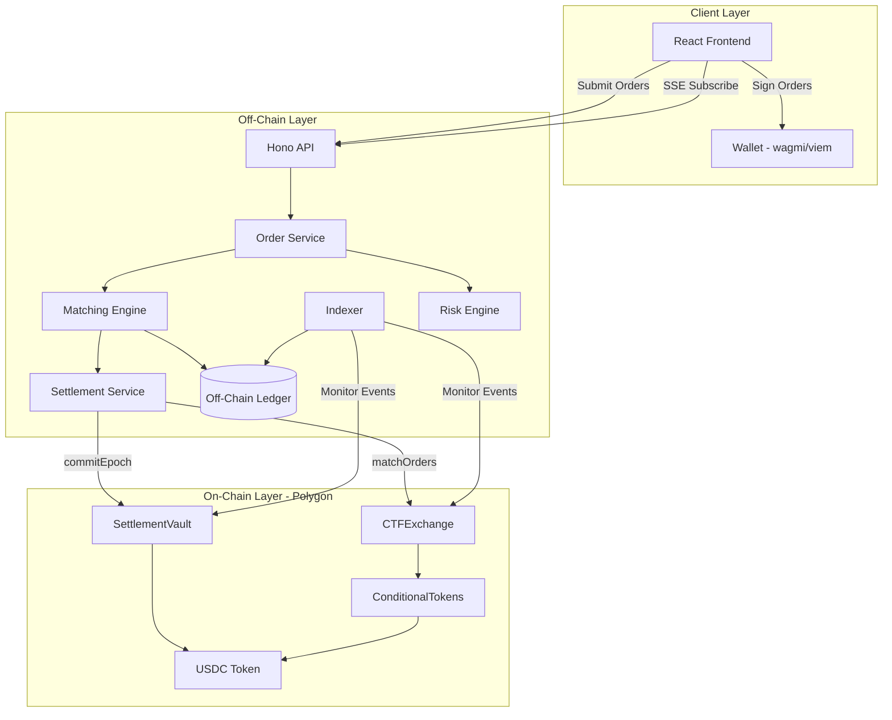
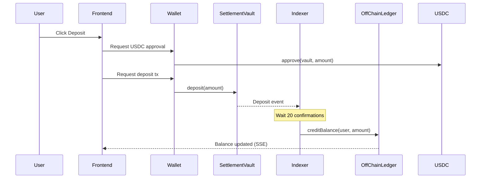
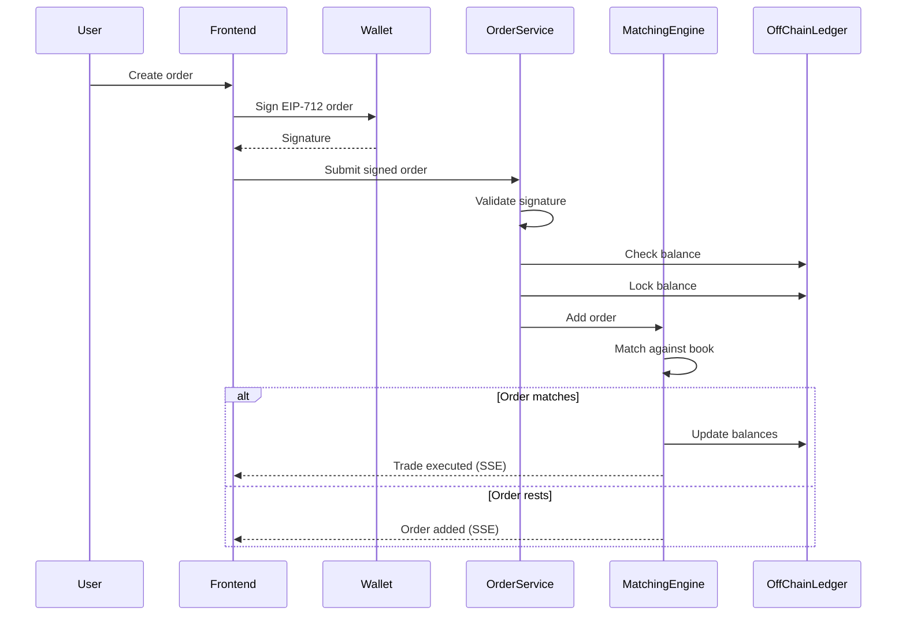
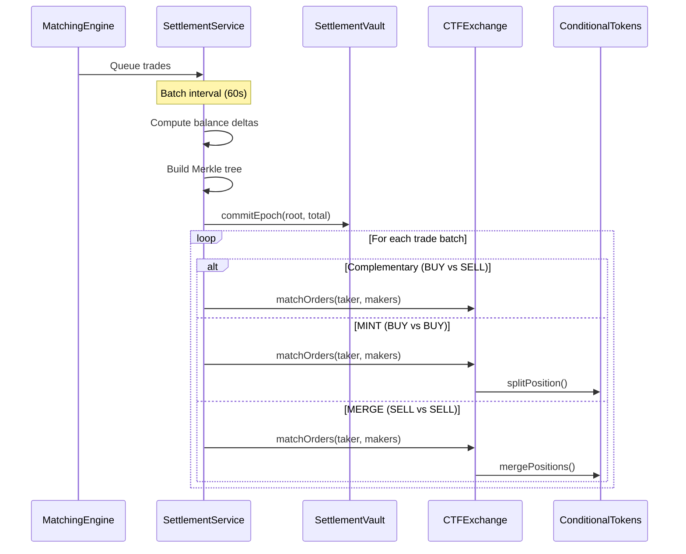

# Design Document: Hybrid CLOB Trading

## Overview

This design implements a Polymarket-style hybrid trading architecture that combines off-chain order matching with on-chain settlement. The system provides instant order matching (sub-millisecond) while maintaining trustless settlement guarantees through smart contracts.

The architecture follows a three-layer model:
1. **Client Layer**: React frontend with wagmi for wallet integration
2. **Off-Chain Layer**: Hono backend with matching engine, settlement service, and indexer
3. **On-Chain Layer**: CTFExchange and SettlementVault contracts on Polygon

Key design principles:
- **Non-custodial**: Users deposit to smart contracts, not operator wallets
- **Verifiable**: All settlements use cryptographic proofs
- **Gas-efficient**: Batch settlement amortizes gas across many trades
- **Resilient**: Users can withdraw via proofs even if backend is down

## Architecture



### Data Flow Diagrams

#### Deposit Flow


#### Order Flow


#### Settlement Flow


## Components and Interfaces

### Backend Components

#### 1. Order Service (`packages/backend/src/services/orderService.ts`)

Handles order validation, signature verification, and submission to matching engine.

```typescript
interface IOrderService {
  // Submit a signed order for matching
  submitOrder(order: SignedOrder): Promise<OrderResult>;
  
  // Cancel an order by ID
  cancelOrder(orderId: string, maker: string): Promise<boolean>;
  
  // Get order status
  getOrder(orderId: string): Promise<OrderBookEntry | null>;
  
  // Get user's open orders
  getUserOrders(user: string): Promise<OrderBookEntry[]>;
}

interface OrderResult {
  orderId: string;
  status: 'accepted' | 'rejected';
  trades: Trade[];
  error?: string;
}
```

#### 2. Matching Engine (`packages/backend/src/services/matchingEngine.ts`)

Enhanced matching engine with MINT/MERGE detection and settlement queuing.

```typescript
interface IMatchingEngine {
  // Add order to book and attempt matching
  addOrder(order: SignedOrder): { trades: Trade[]; orderId: string };
  
  // Cancel order and unlock balance
  cancelOrder(orderId: string, maker: string): boolean;
  
  // Get order book for market
  getOrderBook(marketId: string, tokenId: bigint, depth?: number): OrderBook;
  
  // Get best bid/ask
  getBestBid(marketId: string, tokenId: bigint): PriceLevel | null;
  getBestAsk(marketId: string, tokenId: bigint): PriceLevel | null;
  
  // Get pending trades for settlement
  getPendingTrades(): Trade[];
  clearPendingTrades(): Trade[];
}

interface Trade {
  id: string;
  takerOrderHash: string;
  makerOrderHash: string;
  maker: string;
  taker: string;
  tokenId: bigint;
  amount: bigint;
  price: bigint;
  matchType: MatchType;  // NEW: COMPLEMENTARY | MINT | MERGE
  timestamp: number;
}

enum MatchType {
  COMPLEMENTARY = 0,  // BUY vs SELL
  MINT = 1,           // BUY vs BUY (prices sum >= 1)
  MERGE = 2           // SELL vs SELL (prices sum <= 1)
}
```

#### 3. Settlement Service (`packages/backend/src/services/settlement.ts`)

Enhanced settlement service with CTFExchange integration.

```typescript
interface ISettlementService {
  // Add trades to pending batch
  addTrades(trades: Trade[]): void;
  
  // Create settlement batch from pending trades
  createBatch(): Promise<SettlementBatch | null>;
  
  // Commit batch to on-chain vault
  commitBatch(batch: SettlementBatch): Promise<string>;
  
  // Execute trades on CTFExchange
  executeSettlement(batch: SettlementBatch): Promise<SettlementResult>;
  
  // Get proof for user withdrawal
  getProof(epochId: number, user: string): WithdrawalProof | null;
  
  // Get unclaimed epochs for user
  getUnclaimedEpochs(user: string): number[];
}

interface SettlementBatch {
  epochId: number;
  trades: Trade[];
  balanceDeltas: Map<string, bigint>;
  merkleRoot: string;
  proofs: Map<string, WithdrawalProof>;
  timestamp: number;
  status: 'pending' | 'committed' | 'settled' | 'failed';
}

interface WithdrawalProof {
  epochId: number;
  amount: bigint;
  proof: string[];
}

interface SettlementResult {
  success: boolean;
  txHashes: string[];
  failedTrades: string[];
  error?: string;
}
```

#### 4. Indexer Service (`packages/backend/src/services/indexer.ts`)

New service for monitoring blockchain events and syncing state.

```typescript
interface IIndexerService {
  // Start indexing from block
  start(fromBlock?: number): Promise<void>;
  
  // Stop indexing
  stop(): void;
  
  // Get current indexed block
  getCurrentBlock(): number;
  
  // Get deposit status
  getDepositStatus(txHash: string): DepositStatus;
  
  // Subscribe to events
  on(event: IndexerEvent, handler: EventHandler): void;
}

type IndexerEvent = 
  | 'deposit'
  | 'withdrawal'
  | 'orderCancelled'
  | 'nonceIncremented'
  | 'epochCommitted'
  | 'reorg';

interface DepositStatus {
  txHash: string;
  user: string;
  amount: bigint;
  blockNumber: number;
  confirmations: number;
  indexed: boolean;
}
```

#### 5. Reconciliation Service (`packages/backend/src/services/reconciliation.ts`)

New service for balance verification.

```typescript
interface IReconciliationService {
  // Run reconciliation check
  reconcile(): Promise<ReconciliationResult>;
  
  // Get historical discrepancies
  getHistory(limit?: number): ReconciliationResult[];
  
  // Check if system is healthy
  isHealthy(): boolean;
}

interface ReconciliationResult {
  timestamp: number;
  onChainTotal: bigint;
  offChainTotal: bigint;
  discrepancy: bigint;
  discrepancyPercent: number;
  healthy: boolean;
  details: UserDiscrepancy[];
}

interface UserDiscrepancy {
  user: string;
  onChain: bigint;
  offChain: bigint;
  difference: bigint;
}
```

#### 6. Off-Chain Ledger (`packages/backend/src/services/ledger.ts`)

New dedicated ledger service for balance management.

```typescript
interface ILedger {
  // Credit balance (from deposit)
  credit(user: string, tokenId: bigint, amount: bigint): void;
  
  // Debit balance (from withdrawal)
  debit(user: string, tokenId: bigint, amount: bigint): void;
  
  // Lock balance for order
  lock(user: string, tokenId: bigint, amount: bigint): void;
  
  // Unlock balance (order cancelled/expired)
  unlock(user: string, tokenId: bigint, amount: bigint): void;
  
  // Transfer between users (trade execution)
  transfer(from: string, to: string, tokenId: bigint, amount: bigint): void;
  
  // Get balance
  getBalance(user: string, tokenId: bigint): UserBalance;
  
  // Get all balances for user
  getAllBalances(user: string): Map<bigint, UserBalance>;
  
  // Get total across all users
  getTotalBalance(tokenId: bigint): bigint;
  
  // Get/set nonce
  getNonce(user: string): bigint;
  setNonce(user: string, nonce: bigint): void;
}

interface UserBalance {
  available: bigint;
  locked: bigint;
}
```

### Frontend Components

#### 1. Trading Hooks (`packages/frontend/src/lib/hooks/useTrading.ts`)

```typescript
// Hook for order management
function useOrders(marketId: string) {
  return {
    orders: OrderBookEntry[];
    submitOrder: (params: OrderParams) => Promise<OrderResult>;
    cancelOrder: (orderId: string) => Promise<boolean>;
    isSubmitting: boolean;
    error: Error | null;
  };
}

// Hook for order book subscription
function useOrderBook(marketId: string, tokenId: bigint) {
  return {
    bids: PriceLevel[];
    asks: PriceLevel[];
    spread: bigint;
    isConnected: boolean;
  };
}

// Hook for user balances
function useBalances() {
  return {
    balances: Map<bigint, UserBalance>;
    deposit: (amount: bigint) => Promise<string>;
    withdraw: (epochId: number) => Promise<string>;
    pendingDeposits: DepositStatus[];
    claimableEpochs: number[];
  };
}

interface OrderParams {
  marketId: string;
  tokenId: bigint;
  side: Side;
  price: bigint;  // In basis points (e.g., 5000 = $0.50)
  quantity: bigint;
}
```

#### 2. Order Signing (`packages/frontend/src/lib/trading/orderSigner.ts`)

```typescript
interface IOrderSigner {
  // Create and sign an order
  createSignedOrder(params: OrderParams, nonce: bigint): Promise<SignedOrder>;
  
  // Get EIP-712 domain
  getDomain(): EIP712Domain;
  
  // Get order type definition
  getOrderTypes(): EIP712Types;
}

interface EIP712Domain {
  name: string;
  version: string;
  chainId: number;
  verifyingContract: string;
}
```

### Smart Contract Enhancements

#### CTFExchange Enhancements

```solidity
// Add support for additional signature types
function _isValidSignature(
    address signer,
    address maker,
    bytes32 structHash,
    bytes memory signature,
    SignatureType sigType
) internal view returns (bool) {
    if (sigType == SignatureType.EOA) {
        return signer == maker && ECDSA.recover(structHash, signature) == signer;
    }
    if (sigType == SignatureType.POLY_PROXY) {
        // Verify via proxy contract
        return IProxyWallet(maker).isValidSignature(structHash, signature) == MAGIC_VALUE;
    }
    if (sigType == SignatureType.POLY_GNOSIS_SAFE) {
        // Verify via Gnosis Safe
        return IGnosisSafe(maker).isValidSignature(structHash, signature) == MAGIC_VALUE;
    }
    return false;
}

// Add fee withdrawal for operator
function withdrawFees(address token, uint256 amount, address to) external onlyOwner;

// Add batch order cancellation with nonce
function cancelAllOrders() external {
    _nonces[msg.sender]++;
    emit AllOrdersCancelled(msg.sender, _nonces[msg.sender]);
}
```

### API Endpoints

```typescript
// Order endpoints
POST   /api/orders              // Submit signed order
DELETE /api/orders/:id          // Cancel order
GET    /api/orders/:id          // Get order status
GET    /api/orders/user/:addr   // Get user's orders

// Order book endpoints
GET    /api/orderbook/:marketId/:tokenId  // Get order book
GET    /api/orderbook/:marketId/:tokenId/stream  // SSE subscription

// Balance endpoints
GET    /api/balances/:addr      // Get user balances
GET    /api/deposits/:addr      // Get deposit history
GET    /api/withdrawals/:addr   // Get withdrawal proofs

// Settlement endpoints
GET    /api/settlement/epochs   // Get recent epochs
GET    /api/settlement/proof/:epochId/:addr  // Get withdrawal proof

// Health endpoints
GET    /api/health              // System health
GET    /api/health/reconciliation  // Reconciliation status
```

## Data Models

### Database Schema (if persisting to DB)

```sql
-- Deposits tracking
CREATE TABLE deposits (
  id UUID PRIMARY KEY,
  tx_hash VARCHAR(66) UNIQUE NOT NULL,
  user_address VARCHAR(42) NOT NULL,
  amount NUMERIC(78) NOT NULL,
  block_number BIGINT NOT NULL,
  confirmations INT DEFAULT 0,
  indexed BOOLEAN DEFAULT FALSE,
  indexed_at TIMESTAMP,
  created_at TIMESTAMP DEFAULT NOW()
);

-- Orders (for history/analytics)
CREATE TABLE orders (
  id VARCHAR(100) PRIMARY KEY,
  order_hash VARCHAR(66) UNIQUE NOT NULL,
  maker VARCHAR(42) NOT NULL,
  market_id VARCHAR(66) NOT NULL,
  token_id NUMERIC(78) NOT NULL,
  side SMALLINT NOT NULL,
  price NUMERIC(78) NOT NULL,
  quantity NUMERIC(78) NOT NULL,
  filled NUMERIC(78) DEFAULT 0,
  status VARCHAR(20) DEFAULT 'open',
  created_at TIMESTAMP DEFAULT NOW(),
  updated_at TIMESTAMP DEFAULT NOW()
);

-- Trades
CREATE TABLE trades (
  id VARCHAR(100) PRIMARY KEY,
  taker_order_id VARCHAR(100) REFERENCES orders(id),
  maker_order_id VARCHAR(100) REFERENCES orders(id),
  maker VARCHAR(42) NOT NULL,
  taker VARCHAR(42) NOT NULL,
  token_id NUMERIC(78) NOT NULL,
  amount NUMERIC(78) NOT NULL,
  price NUMERIC(78) NOT NULL,
  match_type SMALLINT NOT NULL,
  epoch_id INT,
  settled BOOLEAN DEFAULT FALSE,
  created_at TIMESTAMP DEFAULT NOW()
);

-- Settlement epochs
CREATE TABLE epochs (
  id SERIAL PRIMARY KEY,
  merkle_root VARCHAR(66) NOT NULL,
  total_amount NUMERIC(78) NOT NULL,
  trade_count INT NOT NULL,
  tx_hash VARCHAR(66),
  status VARCHAR(20) DEFAULT 'pending',
  created_at TIMESTAMP DEFAULT NOW(),
  committed_at TIMESTAMP
);

-- User proofs per epoch
CREATE TABLE epoch_proofs (
  epoch_id INT REFERENCES epochs(id),
  user_address VARCHAR(42) NOT NULL,
  amount NUMERIC(78) NOT NULL,
  proof JSONB NOT NULL,
  claimed BOOLEAN DEFAULT FALSE,
  PRIMARY KEY (epoch_id, user_address)
);

-- Nonce tracking
CREATE TABLE nonces (
  user_address VARCHAR(42) PRIMARY KEY,
  off_chain_nonce NUMERIC(78) DEFAULT 0,
  on_chain_nonce NUMERIC(78) DEFAULT 0,
  updated_at TIMESTAMP DEFAULT NOW()
);
```

### TypeScript Types

```typescript
// Extended types for hybrid trading
export interface HybridOrder extends SignedOrder {
  id: string;
  status: OrderStatus;
  filled: bigint;
  remaining: bigint;
  trades: string[];  // Trade IDs
  createdAt: number;
  updatedAt: number;
}

export type OrderStatus = 
  | 'pending'      // Submitted, not yet validated
  | 'open'         // In order book
  | 'partial'      // Partially filled
  | 'filled'       // Fully filled
  | 'cancelled'    // Cancelled by user
  | 'expired'      // Past expiration
  | 'rejected';    // Failed validation

export interface MarketState {
  marketId: string;
  yesTokenId: bigint;
  noTokenId: bigint;
  conditionId: string;
  bestBid: PriceLevel | null;
  bestAsk: PriceLevel | null;
  lastPrice: bigint | null;
  volume24h: bigint;
}

export interface PriceLevel {
  price: bigint;
  quantity: bigint;
  orderCount: number;
}

export interface OrderBook {
  bids: PriceLevel[];
  asks: PriceLevel[];
  timestamp: number;
}

// SSE Event Types
export type TradingEvent =
  | { type: 'order_added'; data: OrderBookEntry }
  | { type: 'order_removed'; data: { orderId: string } }
  | { type: 'order_updated'; data: { orderId: string; filled: bigint; remaining: bigint } }
  | { type: 'trade'; data: Trade }
  | { type: 'price_update'; data: { marketId: string; tokenId: bigint; price: bigint } }
  | { type: 'balance_update'; data: { user: string; tokenId: bigint; balance: UserBalance } }
  | { type: 'epoch_committed'; data: { epochId: number; merkleRoot: string } };
```


## Correctness Properties

*A property is a characteristic or behavior that should hold true across all valid executions of a system—essentially, a formal statement about what the system should do. Properties serve as the bridge between human-readable specifications and machine-verifiable correctness guarantees.*

### Property 1: Deposit Round-Trip Consistency

*For any* valid deposit amount, if a user deposits to SettlementVault and the Indexer processes the deposit event with sufficient confirmations, then the user's Off_Chain_Ledger available balance SHALL increase by exactly the deposited amount.

**Validates: Requirements 1.1, 1.2, 1.3**

### Property 2: EIP-712 Order Hash Determinism

*For any* order parameters, constructing an EIP-712 typed data structure and computing its hash SHALL produce the same hash as the CTFExchange contract's hashOrder function for identical parameters.

**Validates: Requirements 2.1**

### Property 3: Signature Validation Correctness

*For any* signed order, the Order_Service SHALL accept the order if and only if the signature was produced by the signer address using the correct EIP-712 domain and order hash.

**Validates: Requirements 2.3**

### Property 4: Nonce Validation

*For any* order submission, the Order_Service SHALL accept the order if and only if the order's nonce equals the user's current nonce in the Off_Chain_Ledger.

**Validates: Requirements 2.4, 11.2**

### Property 5: Balance Sufficiency Check

*For any* order submission, the Order_Service SHALL accept the order if and only if the user's available balance (for the required token) is greater than or equal to the order's makerAmount.

**Validates: Requirements 2.5**

### Property 6: Balance Locking Invariant

*For any* accepted order, the user's available balance SHALL decrease by makerAmount and locked balance SHALL increase by makerAmount, such that available + locked remains constant.

**Validates: Requirements 2.7**

### Property 7: Price-Time Priority Matching

*For any* order book state and incoming order, the Matching_Engine SHALL match against resting orders in strict price-time priority: best price first, then earliest timestamp for equal prices.

**Validates: Requirements 3.1**

### Property 8: Trade Execution at Maker Price

*For any* crossing orders (buy price >= ask price OR sell price <= bid price), the trade SHALL execute at the maker's (resting order's) price, not the taker's price.

**Validates: Requirements 3.2, 3.3**

### Property 9: MINT Match Type Detection

*For any* two buy orders where the sum of their prices >= 1.0 (in normalized units), the Matching_Engine SHALL flag the resulting trade with matchType = MINT.

**Validates: Requirements 3.4**

### Property 10: MERGE Match Type Detection

*For any* two sell orders where the sum of their prices <= 1.0 (in normalized units), the Matching_Engine SHALL flag the resulting trade with matchType = MERGE.

**Validates: Requirements 3.5**

### Property 11: Trade Balance Conservation

*For any* executed trade, the sum of all balance changes across both parties SHALL equal zero (conservation of value), accounting for the trade amount and price.

**Validates: Requirements 3.6**

### Property 12: Trade Queuing Completeness

*For any* executed trade, the trade SHALL appear in the pending trades queue exactly once until cleared by the Settlement_Service.

**Validates: Requirements 3.7**

### Property 13: Partial Fill Order Book Persistence

*For any* partially filled order, the remaining quantity (original quantity - filled quantity) SHALL remain in the order book at the original price.

**Validates: Requirements 3.8**

### Property 14: Balance Delta Computation Correctness

*For any* set of trades in a batch, the computed balance delta for each user SHALL equal the sum of all amounts received minus the sum of all amounts paid across all trades involving that user.

**Validates: Requirements 4.2**

### Property 15: Merkle Tree Inclusion

*For any* user with a positive balance delta in a batch, the generated Merkle proof SHALL verify successfully against the batch's Merkle root.

**Validates: Requirements 4.3, 4.5, 6.2**

### Property 16: Claimable Balance Aggregation

*For any* user with settlements across multiple epochs, the total claimable balance SHALL equal the sum of unclaimed amounts across all epochs where the user has a positive delta.

**Validates: Requirements 6.1**

### Property 17: Valid Claim Execution

*For any* valid Merkle proof and unclaimed epoch, calling claim on SettlementVault SHALL transfer exactly the proven amount to the user.

**Validates: Requirements 6.3**

### Property 18: Double-Claim Prevention

*For any* epoch and user, after a successful claim, subsequent claim attempts for the same epoch SHALL revert with AlreadyClaimed error.

**Validates: Requirements 6.4**

### Property 19: Invalid Proof Rejection

*For any* Merkle proof that does not verify against the epoch's Merkle root, calling claim SHALL revert with InvalidProof error.

**Validates: Requirements 6.5**

### Property 20: Order Cancellation Balance Unlock

*For any* cancelled order, the user's locked balance SHALL decrease by the order's remaining amount and available balance SHALL increase by the same amount.

**Validates: Requirements 7.1**

### Property 21: On-Chain Order Cancellation

*For any* order cancelled via CTFExchange.cancelOrder, the order's status SHALL be marked as isFilledOrCancelled = true, preventing future fills.

**Validates: Requirements 7.2**

### Property 22: Nonce Increment Order Invalidation

*For any* user who calls incrementNonce on CTFExchange, all orders with nonce < new_nonce SHALL fail validation with InvalidNonce error.

**Validates: Requirements 7.3**

### Property 23: Cancelled Order Settlement Exclusion

*For any* order that is cancelled before settlement, the order SHALL NOT appear in any settlement batch.

**Validates: Requirements 7.5**

### Property 24: Risk Limit Enforcement

*For any* operation (order or withdrawal) that exceeds its configured limit (order size, exposure, rate, or daily withdrawal), the Risk_Engine SHALL reject the operation.

**Validates: Requirements 10.1, 10.2, 10.3, 10.4**

### Property 25: Tier-Based Limit Application

*For any* user with a configured tier, the Risk_Engine SHALL apply that tier's limits rather than default limits.

**Validates: Requirements 10.6**

### Property 26: Nonce Authority Resolution

*For any* case where off-chain nonce differs from on-chain nonce, the system SHALL use the higher value (on-chain) as the authoritative nonce.

**Validates: Requirements 11.4**

### Property 27: Fee Calculation Formula

*For any* trade with feeRateBps > 0, the calculated fee SHALL equal: feeRateBps × min(price, 1-price) × outcomeTokens / BPS_DIVISOR.

**Validates: Requirements 12.1**

### Property 28: Fee Deduction on Settlement

*For any* settled trade with fees, the CTFExchange SHALL deduct the fee from the trade proceeds and credit it to the operator.

**Validates: Requirements 12.2**

### Property 29: Gnosis Safe Signature Validation

*For any* order with sigType = POLY_GNOSIS_SAFE, the CTFExchange SHALL validate the signature by calling isValidSignature on the Safe contract.

**Validates: Requirements 13.1, 13.2**

### Property 30: Proxy Wallet Signature Validation

*For any* order with sigType = POLY_PROXY, the CTFExchange SHALL validate the signature by calling isValidSignature on the proxy contract.

**Validates: Requirements 13.3**

## Error Handling

### Backend Error Codes

```typescript
enum TradingErrorCode {
  // Order validation errors
  INVALID_SIGNATURE = 'INVALID_SIGNATURE',
  INVALID_NONCE = 'INVALID_NONCE',
  INSUFFICIENT_BALANCE = 'INSUFFICIENT_BALANCE',
  ORDER_EXPIRED = 'ORDER_EXPIRED',
  INVALID_PRICE = 'INVALID_PRICE',
  INVALID_QUANTITY = 'INVALID_QUANTITY',
  INVALID_TOKEN_ID = 'INVALID_TOKEN_ID',
  
  // Risk errors
  ORDER_SIZE_EXCEEDED = 'ORDER_SIZE_EXCEEDED',
  EXPOSURE_LIMIT_EXCEEDED = 'EXPOSURE_LIMIT_EXCEEDED',
  RATE_LIMIT_EXCEEDED = 'RATE_LIMIT_EXCEEDED',
  WITHDRAWAL_LIMIT_EXCEEDED = 'WITHDRAWAL_LIMIT_EXCEEDED',
  
  // Order management errors
  ORDER_NOT_FOUND = 'ORDER_NOT_FOUND',
  ORDER_NOT_OWNED = 'ORDER_NOT_OWNED',
  ORDER_ALREADY_CANCELLED = 'ORDER_ALREADY_CANCELLED',
  ORDER_ALREADY_FILLED = 'ORDER_ALREADY_FILLED',
  
  // Settlement errors
  EPOCH_NOT_FOUND = 'EPOCH_NOT_FOUND',
  ALREADY_CLAIMED = 'ALREADY_CLAIMED',
  INVALID_PROOF = 'INVALID_PROOF',
  
  // System errors
  SYSTEM_PAUSED = 'SYSTEM_PAUSED',
  RECONCILIATION_FAILED = 'RECONCILIATION_FAILED',
  SETTLEMENT_FAILED = 'SETTLEMENT_FAILED',
}

interface TradingError {
  code: TradingErrorCode;
  message: string;
  details?: Record<string, unknown>;
}
```

### Contract Error Handling

The CTFExchange and SettlementVault contracts use custom errors for gas-efficient reverts:

```solidity
// CTFExchange errors
error InvalidSignature();
error OrderExpired();
error OrderFilledOrCancelled();
error InvalidNonce();
error FeeTooHigh();
error InvalidTokenId();
error InvalidComplement();
error NotOperator();
error NotOwner();
error NotTaker();
error NotCrossing();
error MismatchedTokenIds();
error MakingGtRemaining();
error TooLittleTokensReceived();
error Paused();

// SettlementVault errors
error NotOperator();
error AlreadyClaimed();
error InvalidProof();
error ZeroAmount();
error InsufficientDeposit();
```

### Error Recovery Strategies

1. **Signature Validation Failure**: Return specific error, user must re-sign
2. **Insufficient Balance**: Return error with current balance, user must deposit or reduce order
3. **Nonce Mismatch**: Return current nonce, user must update and re-sign
4. **Settlement Failure**: Retry with exponential backoff, alert operators after 3 failures
5. **Reconciliation Discrepancy**: Pause new orders, alert operators, require manual resolution
6. **Chain Reorg**: Revert affected deposits, re-index from fork point

## Testing Strategy

### Unit Tests

Unit tests verify individual component behavior:

1. **Order Signer Tests**
   - EIP-712 domain construction
   - Order hash computation
   - Signature verification

2. **Matching Engine Tests**
   - Order insertion (bid/ask sorting)
   - Price-time priority matching
   - Partial fill handling
   - MINT/MERGE detection

3. **Ledger Tests**
   - Balance credit/debit
   - Lock/unlock operations
   - Transfer between users

4. **Merkle Tree Tests**
   - Tree construction
   - Proof generation
   - Proof verification

5. **Risk Engine Tests**
   - Order size limits
   - Exposure limits
   - Rate limiting
   - Withdrawal limits

### Property-Based Tests

Property-based tests use fast-check to verify universal properties across random inputs:

**Configuration**: Minimum 100 iterations per property test.

**Tag Format**: `Feature: hybrid-clob-trading, Property N: [property_text]`

1. **Matching Engine Properties**
   - Price-time priority (Property 7)
   - Trade at maker price (Property 8)
   - MINT/MERGE detection (Properties 9, 10)
   - Balance conservation (Property 11)
   - Partial fill persistence (Property 13)

2. **Ledger Properties**
   - Balance locking invariant (Property 6)
   - Cancellation unlock (Property 20)

3. **Settlement Properties**
   - Delta computation (Property 14)
   - Merkle inclusion (Property 15)
   - Claimable aggregation (Property 16)

4. **Validation Properties**
   - Nonce validation (Property 4)
   - Balance sufficiency (Property 5)
   - Risk limit enforcement (Property 24)

5. **Fee Properties**
   - Fee calculation formula (Property 27)

### Contract Tests (Foundry)

Solidity tests for smart contract behavior:

1. **CTFExchange Tests**
   - fillOrder execution
   - matchOrders with MINT/MERGE
   - Order cancellation
   - Nonce increment
   - Fee collection
   - Signature validation (EOA, Safe, Proxy)

2. **SettlementVault Tests**
   - Deposit flow
   - Epoch commitment
   - Claim with valid proof
   - Double-claim prevention
   - Invalid proof rejection

3. **Fuzz Tests**
   - Random order parameters
   - Random fill amounts
   - Random proof verification

### Integration Tests

End-to-end tests for complete flows:

1. **Deposit → Trade → Withdraw Flow**
2. **Order Submission → Matching → Settlement Flow**
3. **Cancellation Flow (off-chain and on-chain)**
4. **Reconciliation Flow**
5. **Chain Reorg Handling**

### Test Data Generators

```typescript
// fast-check arbitraries for property tests
const orderArbitrary = fc.record({
  salt: fc.bigUintN(256),
  maker: addressArbitrary,
  signer: addressArbitrary,
  taker: fc.constant('0x0000000000000000000000000000000000000000'),
  marketId: bytes32Arbitrary,
  tokenId: fc.bigUintN(256),
  side: fc.constantFrom(Side.BUY, Side.SELL),
  makerAmount: fc.bigUintN(128).filter(n => n > 0n),
  takerAmount: fc.bigUintN(128).filter(n => n > 0n),
  expiration: fc.bigUintN(64),
  nonce: fc.bigUintN(64),
  feeRateBps: fc.bigUintN(16).filter(n => n <= 1000n),
  sigType: fc.constant(SignatureType.EOA),
});

const tradeArbitrary = fc.record({
  id: fc.string(),
  maker: addressArbitrary,
  taker: addressArbitrary,
  tokenId: fc.bigUintN(256),
  amount: fc.bigUintN(128).filter(n => n > 0n),
  price: fc.bigUintN(64).filter(n => n > 0n && n < 10n ** 18n),
  matchType: fc.constantFrom(MatchType.COMPLEMENTARY, MatchType.MINT, MatchType.MERGE),
});
```
