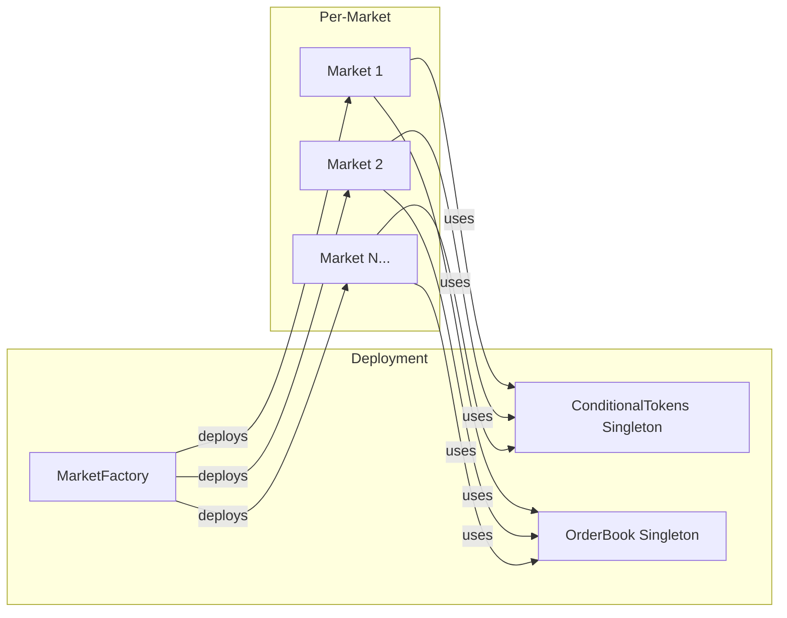

# Design Document: On-Chain Settlement

## Overview

This design transforms Thesis from a centralized debate platform into a decentralized prediction market on Polygon. The architecture follows Polymarket's proven model: a Central Limit Order Book (CLOB) for trading, Conditional Token Framework (CTF) for outcome tokens, and oracle-based resolution.

The system consists of three layers:
1. **Smart Contract Layer** - Solidity contracts on Polygon handling all market logic, token management, and settlement
2. **Integration Layer** - TypeScript/wagmi hooks bridging frontend to contracts
3. **Frontend Layer** - React components for market interaction, leveraging existing UI patterns

Key design decisions:
- **CLOB over AMM**: Better capital efficiency and tighter spreads for binary markets
- **ERC-1155 for outcome tokens**: Gas-efficient batch operations, proven CTF pattern
- **UMA Oracle**: Decentralized resolution with economic guarantees
- **USDC as collateral**: Stable, widely available on Polygon

## Architecture


### Contract Deployment Architecture



## Components and Interfaces

### Smart Contract Components

#### 1. MarketFactory Contract

Deploys and tracks all prediction markets.

```solidity
interface IMarketFactory {
    // Events
    event MarketCreated(
        address indexed market,
        bytes32 indexed questionId,
        string question,
        uint256 endTime,
        address creator
    );
    
    // State
    function markets(bytes32 questionId) external view returns (address);
    function allMarkets() external view returns (address[] memory);
    function conditionalTokens() external view returns (address);
    function collateralToken() external view returns (address);
    function orderBook() external view returns (address);
    
    // Actions
    function createMarket(
        string calldata question,
        string calldata resolutionCriteria,
        uint256 endTime,
        uint256 initialLiquidity
    ) external returns (address market);
}
```

#### 2. Market Contract

Individual market instance managing lifecycle and resolution.

```solidity
interface IMarket {
    enum State { ACTIVE, PENDING_RESOLUTION, DISPUTED, RESOLVED }
    enum Outcome { UNRESOLVED, YES, NO, INVALID }
    
    // Events
    event StateChanged(State indexed newState);
    event ResolutionProposed(Outcome indexed outcome, address proposer);
    event ResolutionDisputed(address disputer);
    event MarketResolved(Outcome indexed outcome);
    event TokensMinted(address indexed user, uint256 amount);
    event TokensRedeemed(address indexed user, uint256 yesAmount, uint256 noAmount);
    event WinningsRedeemed(address indexed user, Outcome tokenType, uint256 payout);
    
    // State
    function questionId() external view returns (bytes32);
    function question() external view returns (string memory);
    function resolutionCriteria() external view returns (string memory);
    function endTime() external view returns (uint256);
    function state() external view returns (State);
    function outcome() external view returns (Outcome);
    function resolutionTime() external view returns (uint256);
    function disputeEndTime() external view returns (uint256);
    
    // Token IDs
    function yesTokenId() external view returns (uint256);
    function noTokenId() external view returns (uint256);
    
    // Actions
    function mintTokens(uint256 collateralAmount) external;
    function redeemTokens(uint256 amount) external;
    function proposeResolution(Outcome _outcome) external;
    function disputeResolution() external;
    function finalizeResolution() external;
    function redeemWinnings() external;
}
```

#### 3. OrderBook Contract

Central Limit Order Book for trading outcome tokens.

```solidity
interface IOrderBook {
    enum Side { BUY, SELL }
    
    struct Order {
        uint256 id;
        address maker;
        bytes32 marketId;
        uint256 tokenId;  // YES or NO token
        Side side;
        uint256 price;    // In basis points (1-9999 = $0.0001-$0.9999)
        uint256 quantity;
        uint256 filled;
        uint256 timestamp;
        bool active;
    }
    
    // Events
    event OrderPlaced(
        uint256 indexed orderId,
        address indexed maker,
        bytes32 indexed marketId,
        uint256 tokenId,
        Side side,
        uint256 price,
        uint256 quantity
    );
    event OrderFilled(
        uint256 indexed orderId,
        address indexed taker,
        uint256 fillAmount,
        uint256 fillPrice
    );
    event OrderCancelled(uint256 indexed orderId);
    event Trade(
        bytes32 indexed marketId,
        uint256 indexed tokenId,
        address buyer,
        address seller,
        uint256 price,
        uint256 quantity
    );
    
    // State
    function orders(uint256 orderId) external view returns (Order memory);
    function getBestBid(bytes32 marketId, uint256 tokenId) external view returns (uint256 price, uint256 quantity);
    function getBestAsk(bytes32 marketId, uint256 tokenId) external view returns (uint256 price, uint256 quantity);
    function getOrderBook(bytes32 marketId, uint256 tokenId, uint256 depth) 
        external view returns (Order[] memory bids, Order[] memory asks);
    function getUserOrders(address user) external view returns (Order[] memory);
    
    // Actions
    function placeOrder(
        bytes32 marketId,
        uint256 tokenId,
        Side side,
        uint256 price,
        uint256 quantity
    ) external returns (uint256 orderId);
    
    function cancelOrder(uint256 orderId) external;
    
    function matchOrders(bytes32 marketId, uint256 tokenId) external;
}
```

#### 4. ConditionalTokens Contract (ERC-1155)

Manages outcome token minting, transfers, and redemption.

```solidity
interface IConditionalTokens {
    // Events (standard ERC-1155 plus custom)
    event ConditionPreparation(
        bytes32 indexed conditionId,
        address indexed oracle,
        bytes32 indexed questionId,
        uint256 outcomeSlotCount
    );
    event PositionSplit(
        address indexed stakeholder,
        bytes32 indexed conditionId,
        uint256 amount
    );
    event PositionMerge(
        address indexed stakeholder,
        bytes32 indexed conditionId,
        uint256 amount
    );
    event PayoutRedemption(
        address indexed redeemer,
        bytes32 indexed conditionId,
        uint256[] indexSets,
        uint256 payout
    );
    
    // State
    function balanceOf(address account, uint256 id) external view returns (uint256);
    function getConditionId(address oracle, bytes32 questionId, uint256 outcomeSlotCount) 
        external pure returns (bytes32);
    function getPositionId(address collateralToken, bytes32 conditionId, uint256 indexSet) 
        external pure returns (uint256);
    function payoutNumerators(bytes32 conditionId, uint256 index) external view returns (uint256);
    function payoutDenominator(bytes32 conditionId) external view returns (uint256);
    
    // Actions
    function prepareCondition(address oracle, bytes32 questionId, uint256 outcomeSlotCount) external;
    function splitPosition(
        address collateralToken,
        bytes32 parentCollectionId,
        bytes32 conditionId,
        uint256[] calldata partition,
        uint256 amount
    ) external;
    function mergePositions(
        address collateralToken,
        bytes32 parentCollectionId,
        bytes32 conditionId,
        uint256[] calldata partition,
        uint256 amount
    ) external;
    function redeemPositions(
        address collateralToken,
        bytes32 parentCollectionId,
        bytes32 conditionId,
        uint256[] calldata indexSets
    ) external;
    function reportPayouts(bytes32 questionId, uint256[] calldata payouts) external;
}
```

### Frontend Integration Components

#### 5. Wallet Connection Hook

```typescript
// packages/frontend/src/lib/hooks/useWalletConnection.ts
interface WalletConnectionState {
  address: `0x${string}` | undefined;
  isConnected: boolean;
  isConnecting: boolean;
  chainId: number | undefined;
  isCorrectChain: boolean;
}

interface WalletConnectionActions {
  connect: (connector: Connector) => Promise<void>;
  disconnect: () => void;
  switchToPolygon: () => Promise<void>;
}

type UseWalletConnection = () => WalletConnectionState & WalletConnectionActions;
```

#### 6. Market Contract Hook

```typescript
// packages/frontend/src/lib/hooks/useMarket.ts
interface MarketState {
  questionId: `0x${string}`;
  question: string;
  resolutionCriteria: string;
  endTime: Date;
  state: 'ACTIVE' | 'PENDING_RESOLUTION' | 'DISPUTED' | 'RESOLVED';
  outcome: 'UNRESOLVED' | 'YES' | 'NO' | 'INVALID';
  yesTokenId: bigint;
  noTokenId: bigint;
}

interface MarketActions {
  mintTokens: (amount: bigint) => Promise<`0x${string}`>;
  redeemTokens: (amount: bigint) => Promise<`0x${string}`>;
  redeemWinnings: () => Promise<`0x${string}`>;
}

type UseMarket = (marketAddress: `0x${string}`) => {
  data: MarketState | undefined;
  isLoading: boolean;
  error: Error | null;
  actions: MarketActions;
};
```

#### 7. Order Book Hook

```typescript
// packages/frontend/src/lib/hooks/useOrderBook.ts
interface OrderBookLevel {
  price: number;  // 0.01 - 0.99
  quantity: bigint;
  orderCount: number;
}

interface OrderBookState {
  bids: OrderBookLevel[];
  asks: OrderBookLevel[];
  midPrice: number | null;
  spread: number | null;
  lastTradePrice: number | null;
}

interface OrderBookActions {
  placeBuyOrder: (tokenId: bigint, price: number, quantity: bigint) => Promise<`0x${string}`>;
  placeSellOrder: (tokenId: bigint, price: number, quantity: bigint) => Promise<`0x${string}`>;
  cancelOrder: (orderId: bigint) => Promise<`0x${string}`>;
}

type UseOrderBook = (marketId: `0x${string}`) => {
  data: OrderBookState | undefined;
  isLoading: boolean;
  error: Error | null;
  actions: OrderBookActions;
};
```

#### 8. Position Hook

```typescript
// packages/frontend/src/lib/hooks/usePositions.ts
interface Position {
  marketAddress: `0x${string}`;
  marketQuestion: string;
  yesBalance: bigint;
  noBalance: bigint;
  avgEntryPrice: number;
  currentPrice: number;
  unrealizedPnL: number;
  marketState: 'ACTIVE' | 'PENDING_RESOLUTION' | 'DISPUTED' | 'RESOLVED';
}

interface OpenOrder {
  orderId: bigint;
  marketAddress: `0x${string}`;
  tokenType: 'YES' | 'NO';
  side: 'BUY' | 'SELL';
  price: number;
  quantity: bigint;
  filled: bigint;
  timestamp: Date;
}

type UsePositions = (userAddress: `0x${string}`) => {
  positions: Position[];
  openOrders: OpenOrder[];
  totalValue: bigint;
  totalPnL: number;
  isLoading: boolean;
};
```

## Data Models

### On-Chain Data Structures

```solidity
// Market state stored on-chain
struct MarketData {
    bytes32 questionId;
    string question;
    string resolutionCriteria;
    uint256 endTime;
    address creator;
    State state;
    Outcome outcome;
    uint256 resolutionTime;
    uint256 disputeEndTime;
    uint256 yesTokenId;
    uint256 noTokenId;
    uint256 totalCollateral;
}

// Order stored in OrderBook
struct Order {
    uint256 id;
    address maker;
    bytes32 marketId;
    uint256 tokenId;
    Side side;
    uint256 price;      // Basis points (1-9999)
    uint256 quantity;
    uint256 filled;
    uint256 timestamp;
    bool active;
}

// Trade record (emitted as event, indexed off-chain)
struct Trade {
    bytes32 marketId;
    uint256 tokenId;
    address buyer;
    address seller;
    uint256 price;
    uint256 quantity;
    uint256 timestamp;
}
```

### Frontend Data Models

```typescript
// packages/shared/src/market-types.ts

export type MarketState = 'ACTIVE' | 'PENDING_RESOLUTION' | 'DISPUTED' | 'RESOLVED';
export type MarketOutcome = 'UNRESOLVED' | 'YES' | 'NO' | 'INVALID';
export type OrderSide = 'BUY' | 'SELL';
export type TokenType = 'YES' | 'NO';

export interface Market {
  address: `0x${string}`;
  questionId: `0x${string}`;
  question: string;
  resolutionCriteria: string;
  endTime: Date;
  creator: `0x${string}`;
  state: MarketState;
  outcome: MarketOutcome;
  yesPrice: number;  // 0-1
  noPrice: number;   // 0-1
  volume24h: bigint;
  totalLiquidity: bigint;
}

export interface Order {
  id: bigint;
  maker: `0x${string}`;
  marketId: `0x${string}`;
  tokenType: TokenType;
  side: OrderSide;
  price: number;      // 0.01-0.99
  quantity: bigint;
  filled: bigint;
  timestamp: Date;
  active: boolean;
}

export interface Position {
  marketAddress: `0x${string}`;
  yesBalance: bigint;
  noBalance: bigint;
  avgYesEntryPrice: number;
  avgNoEntryPrice: number;
}

export interface TradeHistory {
  id: string;
  marketAddress: `0x${string}`;
  tokenType: TokenType;
  side: OrderSide;
  price: number;
  quantity: bigint;
  timestamp: Date;
  txHash: `0x${string}`;
}

// Price in basis points for contract interaction
export const priceToBasisPoints = (price: number): bigint => 
  BigInt(Math.round(price * 10000));

export const basisPointsToPrice = (bp: bigint): number => 
  Number(bp) / 10000;

// Token amount conversions (6 decimals for USDC)
export const USDC_DECIMALS = 6;
export const toUsdcUnits = (amount: number): bigint => 
  BigInt(Math.round(amount * 10 ** USDC_DECIMALS));

export const fromUsdcUnits = (units: bigint): number => 
  Number(units) / 10 ** USDC_DECIMALS;
```

### Contract Configuration

```typescript
// packages/frontend/src/lib/contracts/config.ts

export const POLYGON_CHAIN_ID = 137;
export const POLYGON_MUMBAI_CHAIN_ID = 80001;

export const CONTRACT_ADDRESSES = {
  [POLYGON_CHAIN_ID]: {
    marketFactory: '0x...' as `0x${string}`,
    conditionalTokens: '0x...' as `0x${string}`,
    orderBook: '0x...' as `0x${string}`,
    usdc: '0x3c499c542cEF5E3811e1192ce70d8cC03d5c3359' as `0x${string}`, // USDC on Polygon
  },
  [POLYGON_MUMBAI_CHAIN_ID]: {
    marketFactory: '0x...' as `0x${string}`,
    conditionalTokens: '0x...' as `0x${string}`,
    orderBook: '0x...' as `0x${string}`,
    usdc: '0x...' as `0x${string}`, // Test USDC
  },
} as const;

export const PROTOCOL_FEE_BPS = 200; // 2%
export const MIN_INITIAL_LIQUIDITY = toUsdcUnits(10); // 10 USDC
export const DISPUTE_PERIOD_SECONDS = 24 * 60 * 60; // 24 hours
```


## Correctness Properties

*A property is a characteristic or behavior that should hold true across all valid executions of a system—essentially, a formal statement about what the system should do. Properties serve as the bridge between human-readable specifications and machine-verifiable correctness guarantees.*

### Smart Contract Properties

**Property 1: Token Minting Balance Invariant**

*For any* collateral deposit into a market, the amount of YES tokens minted SHALL equal the amount of NO tokens minted, and both SHALL equal the collateral amount deposited (in token units).

**Validates: Requirements 1.2, 2.1**

---

**Property 2: Token Redemption Round-Trip**

*For any* user who mints tokens by depositing collateral, if they subsequently redeem equal amounts of YES and NO tokens, they SHALL receive back the original collateral amount (before any fees).

**Validates: Requirements 2.2**

---

**Property 3: Order Escrow Round-Trip**

*For any* sell order placed on the order book, the maker's token balance SHALL decrease by the order quantity. If the order is cancelled before being filled, the maker's token balance SHALL be restored to its original value.

**Validates: Requirements 3.2, 3.6**

---

**Property 4: Order Matching Price-Time Priority**

*For any* set of orders in the order book, when a new order arrives that can match multiple existing orders, the order book SHALL fill against orders with the best price first, and among orders at the same price, SHALL fill against the earliest timestamp first.

**Validates: Requirements 3.5**

---

**Property 5: Trade Settlement Token Flows**

*For any* executed trade, the buyer's outcome token balance SHALL increase by the trade quantity, the seller's outcome token balance SHALL decrease by the trade quantity, the buyer's collateral balance SHALL decrease by (price × quantity), and the seller's collateral balance SHALL increase by (price × quantity).

**Validates: Requirements 3.4**

---

**Property 6: Settlement Payout for Winners**

*For any* resolved market with outcome YES or NO, holders of the winning token type SHALL be able to redeem each token for 1.00 USDC (minus protocol fee), and holders of the losing token type SHALL receive 0.00 USDC.

**Validates: Requirements 5.1, 5.2, 5.7**

---

**Property 7: Settlement Fee Calculation**

*For any* winning token redemption, the payout SHALL equal (token_amount × 1.00 × (1 - 0.02)), where 0.02 represents the 2% protocol fee.

**Validates: Requirements 5.4, 5.5**

---

**Property 8: Invalid Market 50/50 Redemption**

*For any* market resolved with INVALID outcome, all token holders (both YES and NO) SHALL be able to redeem each token for exactly 0.50 USDC (minus protocol fee).

**Validates: Requirements 4.6**

---

**Property 9: Mid-Price Calculation**

*For any* order book state with at least one bid and one ask, the mid-price SHALL equal (best_bid_price + best_ask_price) / 2.

**Validates: Requirements 8.1**

---

**Property 10: P&L Calculation**

*For any* position with known average entry price and current market price, the unrealized P&L SHALL equal (current_price - average_entry_price) × quantity.

**Validates: Requirements 7.3**

---

**Property 11: Reentrancy Protection**

*For any* external call sequence that attempts to re-enter a contract function before the first call completes, the contract SHALL revert the reentrant call.

**Validates: Requirements 9.1**

---

**Property 12: Access Control Enforcement**

*For any* administrative function call from a non-authorized address, the contract SHALL revert the transaction.

**Validates: Requirements 9.3**

---

**Property 13: Pause Functionality**

*For any* trading operation (order placement, order matching, token minting) attempted while the system is paused, the contract SHALL revert the transaction.

**Validates: Requirements 9.4**

---

**Property 14: Price Boundary Validation**

*For any* order placement with price ≤ 0.00 or price ≥ 1.00, the order book SHALL revert the transaction.

**Validates: Requirements 3.8**

---

**Property 15: Market End Date Validation**

*For any* market creation attempt with end date in the past, the market factory SHALL revert the transaction.

**Validates: Requirements 1.5**

---

**Property 16: Minimum Collateral Enforcement**

*For any* market creation attempt with initial liquidity less than 10 USDC, the market factory SHALL revert the transaction.

**Validates: Requirements 1.6**

---

**Property 17: Total Supply Invariant**

*For any* market, the total supply of YES tokens SHALL equal the total supply of NO tokens at all times.

**Validates: Requirements 2.5**

---

**Property 18: Position Aggregation**

*For any* user with positions across multiple markets, the portfolio total value SHALL equal the sum of individual position values across all markets.

**Validates: Requirements 7.6**

## Error Handling

### Smart Contract Errors

```solidity
// MarketFactory errors
error InvalidEndDate(uint256 endDate, uint256 currentTime);
error InsufficientInitialLiquidity(uint256 provided, uint256 minimum);
error MarketAlreadyExists(bytes32 questionId);

// Market errors
error MarketNotActive();
error MarketNotPendingResolution();
error MarketNotResolved();
error MarketAlreadyResolved();
error DisputePeriodNotEnded();
error DisputePeriodEnded();
error InvalidOutcome();
error UnauthorizedOracle();
error InsufficientTokenBalance(uint256 required, uint256 available);
error TokenAmountMismatch(uint256 yesAmount, uint256 noAmount);

// OrderBook errors
error InvalidPrice(uint256 price);
error InvalidQuantity();
error OrderNotFound(uint256 orderId);
error OrderNotActive(uint256 orderId);
error UnauthorizedCancellation(address caller, address maker);
error InsufficientCollateral(uint256 required, uint256 available);
error MarketPaused();

// Settlement errors
error NoWinningTokens();
error AlreadyRedeemed();
```

### Frontend Error Handling

```typescript
// packages/frontend/src/lib/errors/contract-errors.ts

export type ContractErrorCode =
  | 'INVALID_END_DATE'
  | 'INSUFFICIENT_LIQUIDITY'
  | 'MARKET_NOT_ACTIVE'
  | 'INVALID_PRICE'
  | 'INSUFFICIENT_BALANCE'
  | 'ORDER_NOT_FOUND'
  | 'UNAUTHORIZED'
  | 'MARKET_PAUSED'
  | 'USER_REJECTED'
  | 'NETWORK_ERROR'
  | 'UNKNOWN';

export interface ContractError {
  code: ContractErrorCode;
  message: string;
  details?: Record<string, unknown>;
}

export function parseContractError(error: unknown): ContractError {
  // Parse revert reasons from contract calls
  if (error instanceof Error) {
    const message = error.message.toLowerCase();
    
    if (message.includes('user rejected')) {
      return { code: 'USER_REJECTED', message: 'Transaction was rejected' };
    }
    if (message.includes('invalid price')) {
      return { code: 'INVALID_PRICE', message: 'Price must be between $0.01 and $0.99' };
    }
    if (message.includes('insufficient')) {
      return { code: 'INSUFFICIENT_BALANCE', message: 'Insufficient balance for this operation' };
    }
    if (message.includes('paused')) {
      return { code: 'MARKET_PAUSED', message: 'Trading is currently paused' };
    }
  }
  
  return { code: 'UNKNOWN', message: 'An unexpected error occurred' };
}
```

### Transaction State Management

```typescript
// packages/frontend/src/lib/hooks/useTransaction.ts

export type TransactionState =
  | { status: 'idle' }
  | { status: 'pending_signature' }
  | { status: 'pending_confirmation'; hash: `0x${string}` }
  | { status: 'confirmed'; hash: `0x${string}`; receipt: TransactionReceipt }
  | { status: 'failed'; error: ContractError };

export function useTransaction() {
  const [state, setState] = useState<TransactionState>({ status: 'idle' });
  
  const execute = async (
    writeFn: () => Promise<`0x${string}`>,
    waitForReceipt: (hash: `0x${string}`) => Promise<TransactionReceipt>
  ) => {
    try {
      setState({ status: 'pending_signature' });
      const hash = await writeFn();
      
      setState({ status: 'pending_confirmation', hash });
      const receipt = await waitForReceipt(hash);
      
      setState({ status: 'confirmed', hash, receipt });
      return receipt;
    } catch (error) {
      const parsed = parseContractError(error);
      setState({ status: 'failed', error: parsed });
      throw error;
    }
  };
  
  return { state, execute, reset: () => setState({ status: 'idle' }) };
}
```

## Testing Strategy

### Dual Testing Approach

This system requires both unit tests and property-based tests:

- **Unit tests**: Verify specific examples, edge cases, integration points, and error conditions
- **Property tests**: Verify universal properties across randomized inputs using fast-check

### Smart Contract Testing

**Framework**: Foundry (forge) with fuzzing support

**Test Organization**:
```
contracts/
├── test/
│   ├── MarketFactory.t.sol      # Unit tests
│   ├── MarketFactory.fuzz.sol   # Fuzz/property tests
│   ├── Market.t.sol
│   ├── Market.fuzz.sol
│   ├── OrderBook.t.sol
│   ├── OrderBook.fuzz.sol
│   └── helpers/
│       ├── TestSetup.sol
│       └── Generators.sol
```

**Property Test Configuration**:
- Minimum 256 fuzz runs per property
- Use bounded inputs for realistic scenarios
- Tag format: `/// @dev Feature: on-chain-settlement, Property N: [property_text]`

**Example Property Test**:
```solidity
/// @dev Feature: on-chain-settlement, Property 1: Token Minting Balance Invariant
function testFuzz_mintingBalanceInvariant(uint256 collateralAmount) public {
    // Bound to realistic range
    collateralAmount = bound(collateralAmount, MIN_COLLATERAL, MAX_COLLATERAL);
    
    // Setup
    usdc.mint(user, collateralAmount);
    vm.startPrank(user);
    usdc.approve(address(market), collateralAmount);
    
    // Action
    market.mintTokens(collateralAmount);
    
    // Property: YES == NO == collateral
    uint256 yesBalance = conditionalTokens.balanceOf(user, market.yesTokenId());
    uint256 noBalance = conditionalTokens.balanceOf(user, market.noTokenId());
    
    assertEq(yesBalance, collateralAmount, "YES tokens != collateral");
    assertEq(noBalance, collateralAmount, "NO tokens != collateral");
    assertEq(yesBalance, noBalance, "YES != NO");
}
```

### Frontend Testing

**Framework**: Vitest with fast-check for property-based testing

**Test Organization**:
```
packages/frontend/src/
├── lib/
│   ├── hooks/
│   │   ├── useMarket.ts
│   │   ├── useMarket.test.ts        # Unit tests
│   │   ��── useMarket.property.ts    # Property tests
│   ├── utils/
│   │   ├── calculations.ts
│   │   ├── calculations.test.ts
│   │   └── calculations.property.ts
```

**Property Test Configuration**:
- Minimum 100 iterations per property
- Use fast-check arbitraries for input generation
- Tag format: `// Feature: on-chain-settlement, Property N: [property_text]`

**Example Property Test**:
```typescript
// Feature: on-chain-settlement, Property 10: P&L Calculation
import { fc } from 'fast-check';
import { calculateUnrealizedPnL } from './calculations';

describe('P&L Calculation Property', () => {
  it('should calculate unrealized P&L correctly for any valid inputs', () => {
    fc.assert(
      fc.property(
        fc.float({ min: 0.01, max: 0.99 }), // entryPrice
        fc.float({ min: 0.01, max: 0.99 }), // currentPrice
        fc.bigInt({ min: 1n, max: 1000000n }), // quantity
        (entryPrice, currentPrice, quantity) => {
          const result = calculateUnrealizedPnL(entryPrice, currentPrice, quantity);
          const expected = (currentPrice - entryPrice) * Number(quantity);
          
          // Allow small floating point tolerance
          return Math.abs(result - expected) < 0.0001;
        }
      ),
      { numRuns: 100 }
    );
  });
});
```

### Integration Testing

**Approach**: Test frontend hooks against local Anvil fork

```typescript
// packages/frontend/src/lib/hooks/useMarket.integration.test.ts
import { createTestClient, http } from 'viem';
import { foundry } from 'viem/chains';

describe('useMarket Integration', () => {
  let testClient: TestClient;
  
  beforeAll(async () => {
    testClient = createTestClient({
      chain: foundry,
      mode: 'anvil',
      transport: http('http://localhost:8545'),
    });
  });
  
  it('should mint tokens and update balances', async () => {
    // Deploy contracts, mint tokens, verify state
  });
});
```

### Test Coverage Requirements

| Component | Unit Tests | Property Tests | Integration Tests |
|-----------|------------|----------------|-------------------|
| MarketFactory | ✓ | ✓ (Properties 1, 15, 16) | ✓ |
| Market | ✓ | ✓ (Properties 2, 6, 7, 8, 17) | ✓ |
| OrderBook | ✓ | ✓ (Properties 3, 4, 5, 9, 14) | ✓ |
| Security | ✓ | ✓ (Properties 11, 12, 13) | - |
| Frontend Hooks | ✓ | ✓ (Properties 10, 18) | ✓ |
| Calculations | ✓ | ✓ (Properties 9, 10) | - |