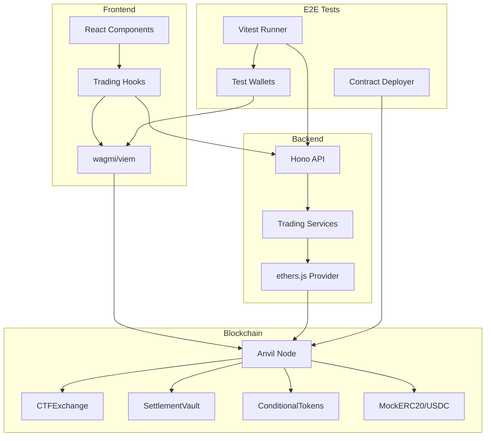
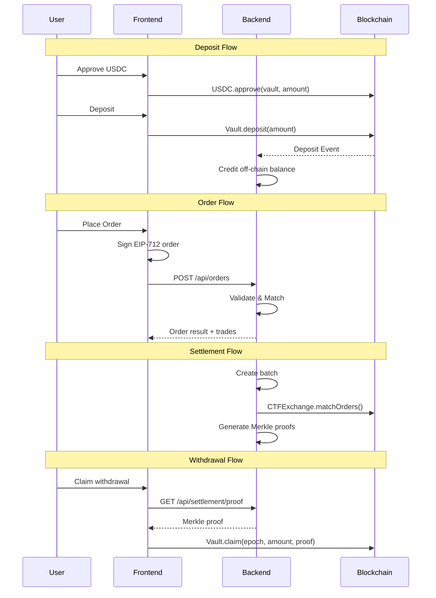

# Design Document: Production Wiring & E2E Testing

## Overview

This design document describes the architecture and implementation approach for removing mock data, wiring the frontend and backend to real blockchain contracts, and creating a comprehensive E2E test suite for the hybrid CLOB trading system.

The system follows a layered architecture:
1. **Frontend Layer**: React components using wagmi/viem for wallet interactions and TanStack Query for API state
2. **Backend Layer**: Hono API server with services connected to blockchain via ethers.js
3. **Contract Layer**: Solidity contracts deployed on Anvil (local), Polygon Amoy (testnet), or Polygon (mainnet)
4. **Test Layer**: E2E test infrastructure using Vitest, Anvil, and real wallet signing

## Architecture



### Component Interaction Flow



## Components and Interfaces

### 1. Configuration Manager

Centralized configuration for contract addresses and network settings.

```typescript
// packages/shared/src/contracts/config.ts

interface NetworkConfig {
  chainId: number;
  name: string;
  rpcUrl: string;
  contracts: {
    ctfExchange: Address;
    settlementVault: Address;
    conditionalTokens: Address;
    usdc: Address;
    marketFactory: Address;
  };
}

interface ConfigManager {
  // Get config for current environment
  getConfig(): NetworkConfig;
  
  // Validate all addresses are non-zero
  validateConfig(): { valid: boolean; errors: string[] };
  
  // Get config for specific chain
  getConfigForChain(chainId: number): NetworkConfig | null;
}
```

### 2. Contract Deployer

Foundry script for deploying contracts to local/test networks.

```solidity
// contracts/script/DeployLocal.s.sol

contract DeployLocal is Script {
    function run() external returns (
        address ctfExchange,
        address settlementVault,
        address conditionalTokens,
        address usdc
    );
    
    // Fund test accounts with USDC
    function fundTestAccounts(address[] memory accounts, uint256 amount) external;
    
    // Verify deployments by calling view functions
    function verifyDeployments() external view returns (bool);
}
```

### 3. Frontend Wiring Layer

Enhanced hooks that connect to real backend and blockchain.

```typescript
// packages/frontend/src/lib/hooks/trading/useOrders.ts

interface UseOrdersReturn {
  orders: OrderEntry[];
  isLoading: boolean;
  isError: boolean;
  error: Error | null;
  
  // Submit signed order to backend
  submitOrder: (params: SubmitOrderParams) => Promise<OrderResult>;
  
  // Cancel order via backend
  cancelOrder: (orderId: string) => Promise<boolean>;
  
  isSubmitting: boolean;
  isCancelling: boolean;
}

// packages/frontend/src/lib/hooks/trading/useBalances.ts

interface UseBalancesReturn {
  balances: Map<string, TokenBalance>;
  nonce: bigint;
  pendingDeposits: PendingDeposit[];
  claimableEpochs: number[];
  
  // Deposit USDC to vault (on-chain)
  deposit: (amount: bigint) => Promise<Hex>;
  
  // Withdraw from epoch using Merkle proof (on-chain)
  withdraw: (epochId: number) => Promise<Hex>;
  
  isDepositing: boolean;
  isWithdrawing: boolean;
}
```

### 4. Backend Wiring Layer

Service initialization with real blockchain connections.

```typescript
// packages/backend/src/services/blockchain.ts

interface BlockchainService {
  // Initialize provider and contracts
  initialize(config: NetworkConfig): Promise<void>;
  
  // Get contract instances
  getCTFExchange(): CTFExchange;
  getSettlementVault(): SettlementVault;
  getConditionalTokens(): ConditionalTokens;
  
  // Check connection health
  isConnected(): boolean;
  
  // Get current block number
  getBlockNumber(): Promise<number>;
}

// packages/backend/src/services/settlement.ts (enhanced)

interface SettlementService {
  // Execute settlement batch on-chain
  settleBatch(batch: SettlementBatch): Promise<{
    success: boolean;
    txHash?: string;
    error?: string;
  }>;
  
  // Retry failed settlements
  retryFailedSettlements(): Promise<void>;
  
  // Get settlement status
  getSettlementStatus(epochId: number): SettlementStatus;
}
```

### 5. E2E Test Infrastructure

Test utilities and fixtures for E2E testing.

```typescript
// packages/frontend/src/lib/__tests__/e2e/setup.ts

interface E2ETestContext {
  // Anvil node process
  anvil: AnvilInstance;
  
  // Backend server
  backend: BackendServer;
  
  // Test wallets with funded balances
  wallets: {
    deployer: TestWallet;
    alice: TestWallet;
    bob: TestWallet;
    operator: TestWallet;
  };
  
  // Deployed contract addresses
  contracts: DeployedContracts;
  
  // Cleanup function
  cleanup: () => Promise<void>;
}

interface TestWallet {
  address: Address;
  privateKey: Hex;
  
  // Sign EIP-712 typed data
  signTypedData(params: SignTypedDataParams): Promise<Hex>;
  
  // Send transaction
  sendTransaction(tx: TransactionRequest): Promise<TransactionReceipt>;
}

// Test fixture factory
function createE2EContext(): Promise<E2ETestContext>;
```

### 6. E2E Test Helpers

Utility functions for common test operations.

```typescript
// packages/frontend/src/lib/__tests__/e2e/helpers.ts

interface E2EHelpers {
  // Deposit USDC to vault
  deposit(wallet: TestWallet, amount: bigint): Promise<TransactionReceipt>;
  
  // Submit signed order
  submitOrder(wallet: TestWallet, params: OrderParams): Promise<OrderResult>;
  
  // Wait for order book update
  waitForOrderBook(marketId: Hex, tokenId: bigint): Promise<OrderBook>;
  
  // Trigger settlement batch
  triggerSettlement(): Promise<SettlementBatch>;
  
  // Claim withdrawal
  claimWithdrawal(wallet: TestWallet, epochId: number): Promise<TransactionReceipt>;
  
  // Get wallet USDC balance
  getUsdcBalance(address: Address): Promise<bigint>;
  
  // Mine blocks on Anvil
  mineBlocks(count: number): Promise<void>;
  
  // Advance time on Anvil
  advanceTime(seconds: number): Promise<void>;
}
```

## Data Models

### Configuration Types

```typescript
// packages/shared/src/contracts/config.ts

type Environment = 'local' | 'testnet' | 'mainnet';

interface ContractAddresses {
  ctfExchange: Address;
  settlementVault: Address;
  conditionalTokens: Address;
  usdc: Address;
  marketFactory: Address;
}

interface NetworkConfig {
  environment: Environment;
  chainId: number;
  chainName: string;
  rpcUrl: string;
  blockExplorerUrl?: string;
  contracts: ContractAddresses;
  confirmations: {
    deposit: number;    // Blocks to wait for deposit confirmation
    settlement: number; // Blocks to wait for settlement confirmation
  };
}

// Environment variable mapping
interface EnvConfig {
  CHAIN_ID: string;
  RPC_URL: string;
  EXCHANGE_ADDRESS: string;
  VAULT_ADDRESS: string;
  CTF_ADDRESS: string;
  USDC_ADDRESS: string;
  OPERATOR_PRIVATE_KEY: string;
}
```

### E2E Test Types

```typescript
// packages/frontend/src/lib/__tests__/e2e/types.ts

interface DeployedContracts {
  ctfExchange: Address;
  settlementVault: Address;
  conditionalTokens: Address;
  usdc: Address;
  marketFactory: Address;
}

interface AnvilInstance {
  process: ChildProcess;
  rpcUrl: string;
  chainId: number;
  
  // Control methods
  start(): Promise<void>;
  stop(): Promise<void>;
  reset(): Promise<void>;
  
  // State manipulation
  mine(blocks: number): Promise<void>;
  setBalance(address: Address, balance: bigint): Promise<void>;
  impersonate(address: Address): Promise<void>;
}

interface BackendServer {
  process: ChildProcess;
  url: string;
  port: number;
  
  start(config: NetworkConfig): Promise<void>;
  stop(): Promise<void>;
  
  // Health check
  isHealthy(): Promise<boolean>;
}

interface TestScenario {
  name: string;
  description: string;
  
  // Setup function
  setup: (ctx: E2ETestContext) => Promise<void>;
  
  // Test steps
  steps: TestStep[];
  
  // Cleanup function
  teardown?: (ctx: E2ETestContext) => Promise<void>;
}

interface TestStep {
  name: string;
  action: (ctx: E2ETestContext) => Promise<void>;
  assertion: (ctx: E2ETestContext) => Promise<void>;
}
```

### Settlement Types (Enhanced)

```typescript
// packages/backend/src/types.ts

interface SettlementBatch {
  epochId: number;
  trades: Trade[];
  merkleRoot: Hex;
  status: SettlementStatus;
  timestamp: number;
  
  // On-chain settlement tracking
  settlementTxHash?: Hex;
  settlementBlockNumber?: number;
  settlementError?: string;
  retryCount: number;
}

type SettlementStatus = 
  | 'pending'      // Batch created, not yet settled
  | 'settling'     // Settlement tx submitted
  | 'committed'    // Settlement confirmed on-chain
  | 'failed'       // Settlement failed after retries
  | 'retrying';    // Retrying after failure

interface SettlementResult {
  success: boolean;
  epochId: number;
  txHash?: Hex;
  blockNumber?: number;
  gasUsed?: bigint;
  error?: string;
}
```

### Validation Types

```typescript
// packages/shared/src/contracts/validation.ts

interface ConfigValidationResult {
  valid: boolean;
  errors: ConfigValidationError[];
  warnings: ConfigValidationWarning[];
}

interface ConfigValidationError {
  field: string;
  message: string;
  value?: string;
}

interface ConfigValidationWarning {
  field: string;
  message: string;
  suggestion?: string;
}

// Validation functions
function validateAddress(address: string): boolean;
function validateNetworkConfig(config: NetworkConfig): ConfigValidationResult;
function validateEnvConfig(env: EnvConfig): ConfigValidationResult;
```


## Correctness Properties

*A property is a characteristic or behavior that should hold true across all valid executions of a system—essentially, a formal statement about what the system should do. Properties serve as the bridge between human-readable specifications and machine-verifiable correctness guarantees.*

Based on the prework analysis of acceptance criteria, the following properties have been identified for property-based testing:

### Property 1: Configuration Validation - No Zero Addresses

*For any* production configuration (testnet or mainnet), all contract addresses in the Config_Manager SHALL be non-zero addresses.

**Validates: Requirements 1.1**

### Property 2: Configuration Loading from Environment

*For any* set of valid Ethereum addresses provided via environment variables, the Config_Manager SHALL correctly load and return those exact addresses in the configuration object.

**Validates: Requirements 1.4**

### Property 3: Address Validation Rejects Invalid Addresses

*For any* string that is not a valid Ethereum address (wrong length, invalid characters, missing 0x prefix), the Config_Manager validation SHALL reject it with an appropriate error.

**Validates: Requirements 5.3**

### Property 4: Deposit Amount Conservation

*For any* deposit amount between 1 USDC and 10,000 USDC, when a user deposits to the SettlementVault and the Indexer processes the deposit event, the credited off-chain balance SHALL equal the deposited amount exactly.

**Validates: Requirements 4.2, 7.3**

### Property 5: EIP-712 Signature Validation

*For any* valid order parameters and wallet, when the order is signed using EIP-712 typed data signing, the backend's signature validation SHALL accept the signature and the recovered signer SHALL match the order's maker address.

**Validates: Requirements 8.5**

### Property 6: Trade Balance Conservation

*For any* pair of matching orders that result in a trade, the sum of all balance changes across all affected accounts SHALL equal zero (no funds created or destroyed).

**Validates: Requirements 9.4**

### Property 7: Settlement Completeness

*For any* settlement batch containing N trades, after settlement completes, all N trades SHALL be included in the on-chain settlement and each trade's participants SHALL have valid Merkle proofs.

**Validates: Requirements 10.4**

### Property 8: Total Lifecycle Conservation

*For any* complete trading lifecycle (deposit → order → match → settle → withdraw), the total USDC in the system (sum of all user balances plus vault balance) SHALL remain constant throughout all operations.

**Validates: Requirements 12.3**

## Error Handling

### Configuration Errors

| Error Condition | Handling Strategy | User Impact |
|----------------|-------------------|-------------|
| Missing RPC_URL | Log warning, disable blockchain features | Backend operates in limited mode |
| Missing contract address | Throw on startup (production), use defaults (local) | Clear error message |
| Invalid address format | Validation error with specific field | Startup fails with actionable message |
| Wrong network | Chain ID mismatch detection | Clear error about network mismatch |

### Blockchain Errors

| Error Condition | Handling Strategy | User Impact |
|----------------|-------------------|-------------|
| RPC connection lost | Retry with exponential backoff, circuit breaker | Temporary degradation, auto-recovery |
| Transaction reverted | Parse revert reason, log details, propagate to frontend | User-friendly error message |
| Out of gas | Log gas estimate vs actual, suggest retry | Retry option with higher gas |
| Nonce too low | Fetch fresh nonce, retry transaction | Transparent retry |
| Block reorg | Re-index affected blocks, reconcile state | Automatic recovery |

### API Errors

| Error Condition | Handling Strategy | User Impact |
|----------------|-------------------|-------------|
| Invalid signature | Return 400 with specific error code | "Invalid signature" message |
| Insufficient balance | Return 400 with balance info | "Insufficient balance" with current balance |
| Order expired | Return 400 with expiration time | "Order expired" message |
| Rate limited | Return 429 with retry-after | "Too many requests" with wait time |
| Internal error | Return 500, log full stack trace | "Something went wrong" generic message |

### E2E Test Error Handling

```typescript
// Error capture and reporting for E2E tests
interface E2EErrorReport {
  testName: string;
  step: string;
  error: Error;
  
  // Context for debugging
  context: {
    walletAddress?: Address;
    transactionHash?: Hex;
    blockNumber?: number;
    contractAddress?: Address;
    functionName?: string;
    args?: unknown[];
  };
  
  // Logs captured during test
  logs: string[];
  
  // Anvil state snapshot (if available)
  stateSnapshot?: string;
}

// Error handler for E2E tests
async function handleE2EError(
  error: Error,
  context: E2ETestContext,
  step: string
): Promise<E2EErrorReport> {
  const report: E2EErrorReport = {
    testName: context.currentTest,
    step,
    error,
    context: {},
    logs: context.capturedLogs,
  };
  
  // Capture transaction details if available
  if (error instanceof TransactionError) {
    report.context.transactionHash = error.txHash;
    report.context.blockNumber = error.blockNumber;
  }
  
  // Capture contract call details if available
  if (error instanceof ContractError) {
    report.context.contractAddress = error.address;
    report.context.functionName = error.functionName;
    report.context.args = error.args;
  }
  
  // Take Anvil state snapshot for debugging
  try {
    report.stateSnapshot = await context.anvil.snapshot();
  } catch {
    // Snapshot failed, continue without it
  }
  
  return report;
}
```

## Testing Strategy

### Dual Testing Approach

This feature requires both unit tests and property-based tests:

1. **Unit Tests**: Verify specific examples, edge cases, and error conditions
   - Configuration loading with specific values
   - Error message formatting
   - API endpoint responses
   - Contract interaction mocking

2. **Property-Based Tests**: Verify universal properties across all inputs
   - Configuration validation properties
   - Balance conservation properties
   - Signature validation properties
   - Settlement completeness properties

### Property-Based Testing Configuration

- **Library**: fast-check (frontend), Foundry fuzz (contracts)
- **Minimum iterations**: 100 per property test
- **Tag format**: `Feature: production-wiring-e2e, Property {number}: {property_text}`

### Test Organization

```
packages/
├── frontend/
│   └── src/
│       └── lib/
│           └── __tests__/
│               └── e2e/
│                   ├── setup.ts           # E2E test infrastructure
│                   ├── helpers.ts         # Test utility functions
│                   ├── types.ts           # E2E test types
│                   ├── deposit.e2e.test.ts
│                   ├── order.e2e.test.ts
│                   ├── matching.e2e.test.ts
│                   ├── settlement.e2e.test.ts
│                   ├── withdrawal.e2e.test.ts
│                   ├── lifecycle.e2e.test.ts
│                   └── errors.e2e.test.ts
│
├── backend/
│   └── test/
│       ├── config.property.test.ts        # Property 1, 2, 3
│       └── integration/
│           └── blockchain.test.ts
│
├── shared/
│   └── src/
│       └── contracts/
│           └── __tests__/
│               └── config.test.ts
│
└── contracts/
    └── test/
        └── E2E.fuzz.sol                   # Property 4, 6, 7, 8
```

### E2E Test Execution

```bash
# Start Anvil with deployed contracts
bun run e2e:setup

# Run all E2E tests
bun run e2e:test

# Run specific E2E test file
bun run e2e:test -- deposit.e2e.test.ts

# Run with verbose logging
bun run e2e:test -- --verbose

# Run in CI mode (no interactive prompts)
CI=true bun run e2e:test
```

### Property Test Execution

```bash
# Run frontend property tests
bun run --cwd packages/frontend test -- --grep "property"

# Run backend property tests
bun run --cwd packages/backend test -- --grep "property"

# Run contract fuzz tests
cd contracts && forge test --match-contract E2EFuzz --fuzz-runs 100
```

### Test Coverage Requirements

| Component | Unit Test Coverage | Property Test Coverage |
|-----------|-------------------|----------------------|
| Config Manager | 90% | Properties 1, 2, 3 |
| Frontend Hooks | 80% | Property 5 |
| Backend Services | 85% | Properties 4, 6, 7 |
| E2E Lifecycle | N/A | Property 8 |

### CI/CD Integration

```yaml
# .github/workflows/e2e.yml
name: E2E Tests

on:
  push:
    branches: [main]
  pull_request:

jobs:
  e2e:
    runs-on: ubuntu-latest
    steps:
      - uses: actions/checkout@v4
      
      - name: Install Foundry
        uses: foundry-rs/foundry-toolchain@v1
      
      - name: Install Bun
        uses: oven-sh/setup-bun@v1
      
      - name: Install dependencies
        run: bun install
      
      - name: Build contracts
        run: cd contracts && forge build
      
      - name: Run E2E tests
        run: bun run e2e:test
        env:
          CI: true
```

