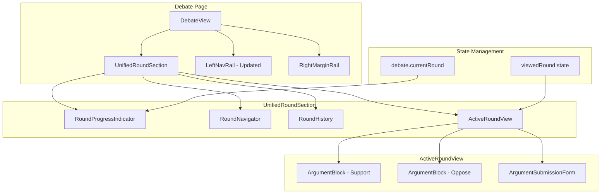

# Design Document: Unified Round Section

## Overview

This design transforms the debate page from displaying three separate round sections to a single, dynamic "Unified Round Section" that adapts based on debate progress. The goal is to reduce page complexity, improve focus on relevant content, and create a more intuitive UX flow.

The current implementation renders all three `RoundSection` components vertically, resulting in a long page with potentially empty sections. The new design introduces a tabbed/stepper interface where only one round is visible at a time, with clear progress indication and easy navigation between rounds.

### Key Design Decisions

1. **Single Active View**: Only one round displayed at a time, reducing cognitive load
2. **Stepper Navigation**: Horizontal stepper showing all three rounds with visual state indicators
3. **History Accordion**: Completed rounds shown as collapsible summaries above the active view
4. **Preserve Existing Components**: Reuse `ArgumentBlock` component within the new structure
5. **State-Driven Display**: Round visibility determined by debate state and user navigation

## Architecture



### Component Hierarchy

```
UnifiedRoundSection
├── RoundProgressIndicator (shows "Round 2 of 3 · Support's turn")
├── RoundNavigator (stepper tabs: Opening | Rebuttal | Closing)
├── RoundHistory (collapsed summaries of completed rounds)
└── ActiveRoundView
    ├── RoundHeader (title + description)
    ├── ArgumentBlock (Support)
    ├── ArgumentBlock (Oppose)
    └── ArgumentSubmissionForm (conditional)
```

## Components and Interfaces

### UnifiedRoundSection

The main container component that orchestrates round display and navigation.

```typescript
interface UnifiedRoundSectionProps {
  debate: Debate;
  rounds: Round[];
  supportDebater?: User | null;
  opposeDebater?: User | null;
  currentUserId?: string;
  onCitationHover?: (citation: Citation | null, position: { top: number }) => void;
  onMindChanged?: (argumentId: string) => void;
  onArgumentSubmit?: (content: string) => void;
}

interface UnifiedRoundSectionState {
  viewedRound: 1 | 2 | 3;  // Which round user is viewing (may differ from active)
  historyExpanded: boolean;
}
```

### RoundProgressIndicator

Displays current debate progress and turn information.

```typescript
interface RoundProgressIndicatorProps {
  currentRound: 1 | 2 | 3;
  currentTurn: 'support' | 'oppose';
  debateStatus: 'active' | 'concluded';
  viewedRound: 1 | 2 | 3;
  rounds: Round[];
}

// Visual states for each round step
type RoundStepState = 'completed' | 'active' | 'pending' | 'viewing-history';
```

### RoundNavigator

Stepper/tab interface for switching between rounds.

```typescript
interface RoundNavigatorProps {
  rounds: Round[];
  currentRound: 1 | 2 | 3;
  viewedRound: 1 | 2 | 3;
  onRoundSelect: (round: 1 | 2 | 3) => void;
}

interface RoundStep {
  roundNumber: 1 | 2 | 3;
  label: string;  // "Opening", "Rebuttal", "Closing"
  state: RoundStepState;
  hasArguments: boolean;
}
```

### RoundHistory

Collapsible summary of completed rounds.

```typescript
interface RoundHistoryProps {
  completedRounds: Round[];
  supportDebater?: User | null;
  opposeDebater?: User | null;
  expanded: boolean;
  onToggle: () => void;
  onRoundClick: (roundNumber: 1 | 2 | 3) => void;
}

interface RoundSummary {
  roundNumber: 1 | 2 | 3;
  roundType: 'opening' | 'rebuttal' | 'closing';
  supportExcerpt: string;  // First 100 chars of support argument
  opposeExcerpt: string;   // First 100 chars of oppose argument
  completedAt: Date;
}
```

### ActiveRoundView

Displays the currently viewed round's full content.

```typescript
interface ActiveRoundViewProps {
  round: Round;
  roundNumber: 1 | 2 | 3;
  supportArgument?: Argument | null;
  opposeArgument?: Argument | null;
  supportAuthor?: User | null;
  opposeAuthor?: User | null;
  isActiveRound: boolean;  // Is this the debate's current round?
  currentTurn?: 'support' | 'oppose';
  canSubmitArgument: boolean;
  onCitationHover?: (citation: Citation | null, position: { top: number }) => void;
  onMindChanged?: (argumentId: string) => void;
  onArgumentSubmit?: (content: string) => void;
}
```

### ArgumentSubmissionForm

Inline form for debaters to submit arguments.

```typescript
interface ArgumentSubmissionFormProps {
  roundType: 'opening' | 'rebuttal' | 'closing';
  side: 'support' | 'oppose';
  onSubmit: (content: string) => void;
  isSubmitting: boolean;
}

// Character limits from shared types
const CHAR_LIMITS = {
  opening: 2000,
  rebuttal: 1500,
  closing: 1000,
};
```

## Data Models

### Round State Derivation

The component derives display state from existing data models:

```typescript
// Derive round step states from debate and rounds data
function deriveRoundStates(
  debate: Debate,
  rounds: Round[],
  viewedRound: 1 | 2 | 3
): RoundStep[] {
  return rounds.map((round, index) => {
    const roundNumber = (index + 1) as 1 | 2 | 3;
    const isCompleted = round.completedAt !== null;
    const isActive = debate.currentRound === roundNumber && debate.status === 'active';
    const isViewing = viewedRound === roundNumber;
    
    let state: RoundStepState;
    if (isViewing && !isActive) {
      state = 'viewing-history';
    } else if (isCompleted) {
      state = 'completed';
    } else if (isActive) {
      state = 'active';
    } else {
      state = 'pending';
    }
    
    return {
      roundNumber,
      label: getRoundLabel(round.roundType),
      state,
      hasArguments: round.supportArgumentId !== null || round.opposeArgumentId !== null,
    };
  });
}

function getRoundLabel(roundType: Round['roundType']): string {
  const labels = {
    opening: 'Opening',
    rebuttal: 'Rebuttal',
    closing: 'Closing',
  };
  return labels[roundType];
}
```

### Argument Excerpt Generation

For history summaries:

```typescript
function generateExcerpt(content: string, maxLength: number = 100): string {
  if (content.length <= maxLength) return content;
  return content.substring(0, maxLength).trim() + '...';
}
```

### Navigation State

```typescript
// Determine if user can navigate to a round
function canNavigateToRound(
  targetRound: 1 | 2 | 3,
  rounds: Round[],
  currentRound: 1 | 2 | 3
): boolean {
  const round = rounds[targetRound - 1];
  if (!round) return false;
  
  // Can always navigate to completed rounds
  if (round.completedAt !== null) return true;
  
  // Can navigate to active round
  if (targetRound === currentRound) return true;
  
  // Cannot navigate to future rounds with no content
  return round.supportArgumentId !== null || round.opposeArgumentId !== null;
}
```


## Correctness Properties

*A property is a characteristic or behavior that should hold true across all valid executions of a system—essentially, a formal statement about what the system should do. Properties serve as the bridge between human-readable specifications and machine-verifiable correctness guarantees.*

Based on the prework analysis, the following properties have been consolidated to eliminate redundancy while ensuring comprehensive coverage:

### Property 1: Round Display Matches Debate State

*For any* debate with a given currentRound and status, the Unified_Round_Section SHALL display the round corresponding to that state:
- Active debates display the round matching currentRound (1→Opening, 2→Rebuttal, 3→Closing)
- Concluded debates display the Closing round by default
- Only one round's content is visible at a time

**Validates: Requirements 1.1, 1.2, 1.3, 1.4, 1.5**

### Property 2: Round State Derivation Correctness

*For any* combination of debate state, rounds data, and viewedRound, the `deriveRoundStates` function SHALL produce correct states:
- Completed rounds (completedAt !== null) → state = 'completed'
- Active round (currentRound === roundNumber && status === 'active') → state = 'active'
- Viewing non-active completed round → state = 'viewing-history'
- Future rounds with no content → state = 'pending'
- Progress indicator shows correct "Round X of 3" text
- Turn indicator shows correct side during active debates

**Validates: Requirements 2.1, 2.2, 2.3, 2.4, 2.5**

### Property 3: Navigation State Transitions

*For any* round navigation action (clicking navigator or history item), the viewedRound state SHALL update correctly:
- Clicking a completed round sets viewedRound to that round number
- Clicking the active round sets viewedRound to currentRound
- `canNavigateToRound` returns true for completed rounds and active round
- `canNavigateToRound` returns false for future rounds with no arguments

**Validates: Requirements 3.1, 3.2, 3.3, 3.5, 4.4**

### Property 4: History Visibility Rules

*For any* debate state and viewedRound combination:
- Round history is visible when viewedRound === currentRound and there are completed rounds
- Round history is NOT visible when currentRound === 1 (no history exists)
- Each history summary contains: roundType, truncated excerpts (≤100 chars), and completion status
- `generateExcerpt` produces strings ≤ maxLength with "..." suffix when truncated

**Validates: Requirements 4.1, 4.3, 4.5**

### Property 5: State Preservation During Updates

*For any* external update (new argument, round completion, SSE event):
- viewedRound remains unchanged when user is viewing a historical round
- "This changed my mind" button attribution state persists across round transitions
- User's viewing context is preserved when new arguments arrive

**Validates: Requirements 3.6, 5.4, 5.5**

### Property 6: Argument Form Visibility

*For any* user viewing a debate:
- Submission form is visible IFF: user is a debater AND it is their turn AND viewing the active round
- Submission form is NOT visible for spectators (non-debaters)
- Submission form is NOT visible when viewing historical rounds

**Validates: Requirements 7.1, 7.4**

### Property 7: Character Limit Display

*For any* round type, the argument submission form SHALL display the correct character limit:
- Opening rounds: 2000 characters
- Rebuttal rounds: 1500 characters
- Closing rounds: 1000 characters

**Validates: Requirements 7.2**

### Property 8: Round Completion Triggers Transition

*For any* round where both arguments are submitted (round.completedAt becomes non-null):
- The newly submitted argument is immediately displayed
- If viewing the completing round, viewedRound advances to the next round (if not final)
- If final round completes, viewedRound remains on Closing

**Validates: Requirements 7.3, 7.5**

### Property 9: TOC Label Generation

*For any* debate state, the TOC "Debate Rounds" entry SHALL:
- Include the current round indicator in format "(X/3)"
- Maintain a single entry for all rounds (not three separate entries)

**Validates: Requirements 8.3**

## Error Handling

### Invalid Round Navigation

When a user attempts to navigate to an unavailable round:
- `canNavigateToRound` returns false
- Navigator button/tab is visually disabled
- Click events are ignored (no state change)
- No error message displayed (graceful degradation)

### Missing Debate Data

When debate or rounds data is missing/loading:
- Display skeleton loading state (existing `DebateViewPending`)
- UnifiedRoundSection renders placeholder content
- Navigation is disabled until data loads

### Argument Submission Failures

When argument submission fails:
- Display error toast via existing `useToast` hook
- Preserve form content (don't clear on error)
- Re-enable submit button for retry
- Optimistic update is rolled back

### SSE Connection Issues

When real-time updates fail:
- Existing `ConnectionStatus` component shows status
- Manual refresh available via existing mechanisms
- State remains consistent with last known good data

### Invalid viewedRound State

If viewedRound somehow becomes invalid (e.g., > 3 or < 1):
- Reset to currentRound as fallback
- Log warning for debugging
- No user-visible error

## Testing Strategy

### Property-Based Testing

Use `fast-check` for property-based tests. Each property test should run minimum 100 iterations.

**Test File**: `packages/frontend/src/components/UnifiedRoundSection.property.tsx`

```typescript
import * as fc from 'fast-check';
import { describe, it, expect } from 'vitest';

// Generators for debate states
const roundNumberArb = fc.constantFrom(1, 2, 3) as fc.Arbitrary<1 | 2 | 3>;
const debateStatusArb = fc.constantFrom('active', 'concluded') as fc.Arbitrary<'active' | 'concluded'>;
const sideArb = fc.constantFrom('support', 'oppose') as fc.Arbitrary<'support' | 'oppose'>;

const roundArb = fc.record({
  id: fc.uuid(),
  debateId: fc.uuid(),
  roundNumber: roundNumberArb,
  roundType: fc.constantFrom('opening', 'rebuttal', 'closing'),
  supportArgumentId: fc.option(fc.uuid(), { nil: null }),
  opposeArgumentId: fc.option(fc.uuid(), { nil: null }),
  completedAt: fc.option(fc.date(), { nil: null }),
});

const debateArb = fc.record({
  id: fc.uuid(),
  currentRound: roundNumberArb,
  currentTurn: sideArb,
  status: debateStatusArb,
  // ... other fields
});
```

### Unit Tests

**Test File**: `packages/frontend/src/components/UnifiedRoundSection.test.tsx`

Unit tests for specific examples and edge cases:
- Round 1 with no history
- Concluded debate defaults to Closing
- Debater sees submission form on their turn
- Spectator never sees submission form
- Character limits match round types

### Integration Tests

Test component interactions:
- Navigation between rounds updates view
- Argument submission triggers optimistic update
- SSE events update round content
- TOC click scrolls to unified section

### Test Configuration

```typescript
// vitest.config.ts additions
export default defineConfig({
  test: {
    // Ensure property tests run sufficient iterations
    testTimeout: 30000, // Allow time for 100+ iterations
  },
});
```

### Test Annotations

Each property test must reference its design property:

```typescript
// Feature: unified-round-section, Property 1: Round Display Matches Debate State
it.prop([debateArb, roundsArb])('displays correct round for debate state', (debate, rounds) => {
  // ... test implementation
});
```
