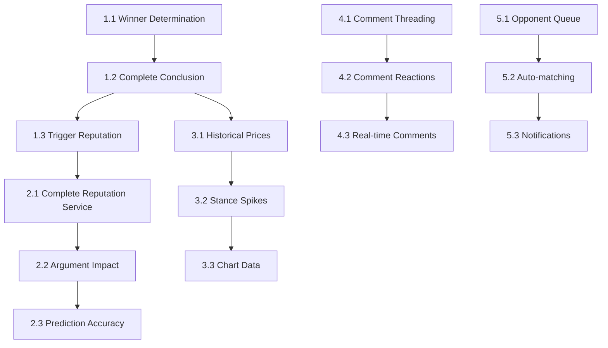

# Debate Platform Implementation Plan

## Vision Alignment
**"A debate platform where every post is a resolution, every debate is structured, and the outcome is determined by measured mind-changes—not raw upvotes."**

**Core Differentiator**: Pre/post stance + persuasion delta + argument impact spikes
**North Star Metric**: Persuasion delta (who changed minds)

**Current Status: 85% Complete**
**Target: 100% Complete**

---

## Phase 1: Core Debate Conclusion Logic ⚡ HIGH PRIORITY

### 1.1 Winner Determination Algorithm
- [x] **File**: `packages/backend/src/services/debate.service.ts`
- [x] **Task**: Implement `determineWinner()` method
- [x] **Logic**: 
  - Calculate final support/oppose percentages from post-stances
  - Winner = side with >55% (buffer for ties)
  - Tie if 45-55% range
- [x] **Status**: ✅ COMPLETED

### 1.2 Complete Debate Conclusion
- [x] **File**: `packages/backend/src/services/debate.service.ts`
- [x] **Task**: Fix `concludeDebate()` method
- [x] **Logic**:
  - Calculate actual final prices from market service
  - Determine winner using new algorithm
  - Calculate total mind changes and net persuasion delta
- [x] **Status**: ✅ COMPLETED

### 1.3 Trigger Reputation Updates
- [x] **File**: `packages/backend/src/services/debate.service.ts`
- [x] **Task**: Call reputation service on debate conclusion
- [x] **Logic**: Update all participants' reputation scores
- [x] **Status**: ✅ COMPLETED

---

## Phase 2: Reputation System Activation 🎯 HIGH PRIORITY

### 2.1 Complete Reputation Service
- [x] **File**: `packages/backend/src/services/reputation.service.ts`
- [x] **Task**: Implement missing methods
- [x] **Methods**:
  - `updateAllParticipants(debateId, result)`
  - `increaseReputation(userId, amount)`
  - `calculateArgumentImpact(argumentId)`
- [x] **Status**: ✅ COMPLETED

### 2.2 Argument Impact Scoring
- [x] **File**: `packages/backend/src/services/reputation.service.ts`
- [x] **Task**: Calculate impact scores from stance attribution
- [x] **Logic**: Sum of attributed stance deltas per argument
- [x] **Status**: ✅ COMPLETED

### 2.3 Prediction Accuracy Updates
- [x] **File**: `packages/backend/src/services/reputation.service.ts`
- [x] **Task**: Update user prediction accuracy on debate conclusion
- [x] **Logic**: Track correct vs total predictions ratio
- [x] **Status**: ✅ COMPLETED

---

## Phase 3: Market Data Tracking 📈 MEDIUM PRIORITY

### 3.1 Historical Price Recording
- [x] **File**: `packages/backend/src/services/market.service.ts`
- [x] **Task**: Implement `recordDataPoint()` method
- [x] **Logic**: Store price snapshots with timestamps
- [x] **Status**: ✅ COMPLETED

### 3.2 Stance Spike Attribution
- [x] **File**: `packages/backend/src/services/market.service.ts`
- [x] **Task**: Implement `detectAndRecordSpikes()` method
- [x] **Logic**: Detect significant price changes and attribute to arguments
- [x] **Status**: ✅ COMPLETED

### 3.3 Chart Data Generation
- [x] **File**: `packages/backend/src/services/market.service.ts`
- [x] **Task**: Add `getChartData()` method
- [x] **Logic**: Return time-series data for frontend charts
- [x] **Status**: ✅ COMPLETED

---

## Phase 4: Enhanced Comment System 💬 MEDIUM PRIORITY

### 4.1 Comment Threading
- [ ] **File**: `packages/backend/src/services/comment.service.ts`
- [ ] **Task**: Implement nested comment retrieval
- [ ] **Logic**: Build comment trees with parent-child relationships
- [ ] **Status**: ❌ Not Started

### 4.2 Comment Reactions
- [ ] **File**: `packages/backend/src/services/reaction.service.ts`
- [ ] **Task**: Extend reactions to comments (not just arguments)
- [ ] **Logic**: Add comment reactions with aggregation
- [ ] **Status**: ❌ Not Started

### 4.3 Real-time Comment Updates
- [ ] **File**: `packages/backend/src/index.ts`
- [ ] **Task**: Add SSE endpoints for comment updates
- [ ] **Logic**: Broadcast new comments to debate viewers
- [ ] **Status**: ❌ Not Started

---

## Phase 5: Opponent Matching System 🤝 LOW PRIORITY

### 5.1 Seeking Opponents Queue
- [ ] **File**: `packages/backend/src/services/matching.service.ts`
- [ ] **Task**: Create new service for opponent matching
- [ ] **Logic**: Queue system for debates seeking opponents
- [ ] **Status**: ❌ Not Started

### 5.2 Auto-matching Algorithm
- [ ] **File**: `packages/backend/src/services/matching.service.ts`
- [ ] **Task**: Implement basic matching logic
- [ ] **Logic**: Match by topic interest, reputation level
- [ ] **Status**: ❌ Not Started

### 5.3 Notification System
- [ ] **File**: `packages/backend/src/services/notification.service.ts`
- [ ] **Task**: Create notification service
- [ ] **Logic**: Notify users of match opportunities
- [ ] **Status**: ❌ Not Started

---

## Implementation Order & Dependencies

---

## Session Progress Tracking

### Completed This Session
- [x] Phase 1.1: Winner Determination Algorithm
- [x] Phase 1.2: Complete Debate Conclusion
- [x] Phase 1.3: Trigger Reputation Updates
- [x] Phase 2.1: Complete Reputation Service
- [x] Phase 2.2: Argument Impact Scoring
- [x] Phase 2.3: Prediction Accuracy Updates
- [x] Phase 3.1: Historical Price Recording
- [x] Phase 3.2: Stance Spike Attribution
- [x] Phase 3.3: Chart Data Generation

### Next Session Goals
- [ ] Phase 4.1: Comment Threading
- [ ] Phase 4.2: Comment Reactions
- [ ] Phase 4.3: Real-time Comment Updates

---

## Testing Strategy

### Unit Tests Required
- [ ] `debate.service.test.ts` - Winner determination logic
- [ ] `reputation.service.test.ts` - Reputation calculations
- [ ] `market.service.test.ts` - Price calculations and spikes

### Integration Tests Required
- [ ] Full debate lifecycle test (creation → conclusion → reputation updates)
- [ ] Market price calculation with real stance data
- [ ] Reputation updates with multiple debate scenarios

---

## Success Criteria

✅ **Phase 1 Complete**: Debates can conclude with proper winners and reputation updates
✅ **Phase 2 Complete**: Reputation system fully functional with impact scoring  
✅ **Phase 3 Complete**: Market data tracking with historical charts
⏳ **Phase 4 In Progress**: Enhanced comment system with threading and reactions
⏳ **Phase 5 Pending**: Opponent matching system operational

**Current Status: 85% Complete** (up from 70%)
**Final Target**: 100% functional debate platform with complete lifecycle management.
